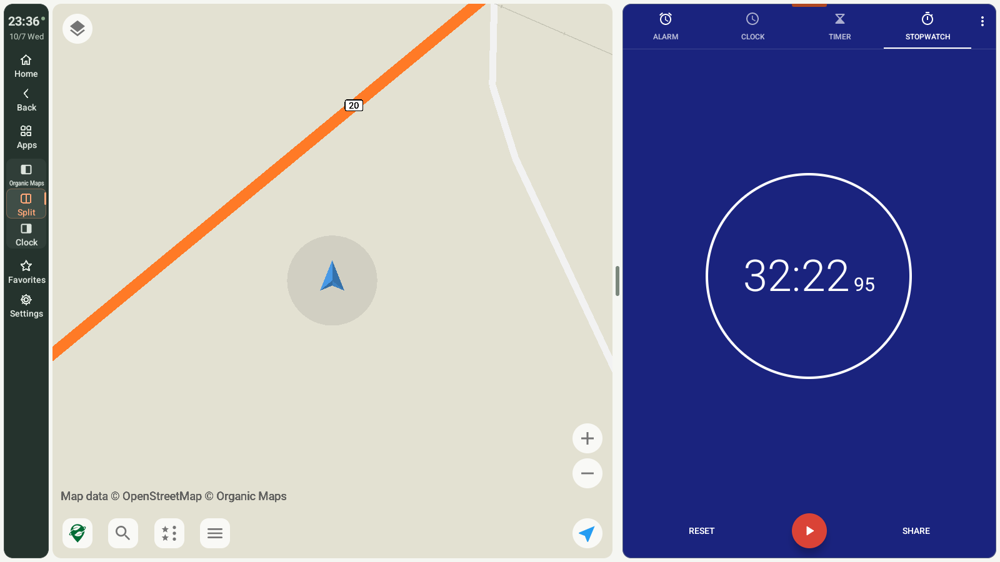

# M4 Launcher

### Keep your map in view, with another app beside it.

[한국어](README.md) · **English**

M4 Launcher is an Android launcher for in-car devices. It shows two installed apps side by side or stacked, and either app can be expanded from the control bar.

M4 Launcher is the new name of DriveDeck, as the app was called until 1.2.1. It is the same app: it installs over an existing DriveDeck and keeps its settings. The install file (`DriveDeck-1.3.0.apk`) and the download address still carry the old name.

The launcher holds its starting screen orientation while running. Split direction and control-bar position remain adjustable in Settings.

[**Download 1.3.0 APK**](https://github.com/bajohy-totb/drivedeck-releases/releases/download/v1.3.0/DriveDeck-1.3.0.apk) · [Releases](https://github.com/bajohy-totb/drivedeck-releases/releases) · [Complete guide](docs/guide.en.md)

**Stable 1.3.0:** the app has a new icon, and the home screen is new. Apps, folders and widgets go where you put them on a grid of cells, on several pages marked by dots. A dock at the foot holds the apps you use most and a button for the list of all apps. That list can also be pulled up from the foot of the home screen, and one more All apps button can be placed on any cell. An app dropped on an app makes a folder. A widget is resized by the handles of a frame. Holding an app shows its shortcuts while M4 Launcher is the device's default home app. The background is one of five drawn ones or your own photo (My photo). The home screen's layout is now part of the settings backup; the photo itself is not. Settings are one frame: the categories stay on the left and what a row opens is shown in the place of the page. There is a Home screen page, updates are a page, and Settings → General has Icon pack. On the control bar, holding the Split button or an app's button changes what is shown there. On a low screen the bar makes its buttons a little lower instead of cutting the last one, and keeps the clock and the temperature as long as they fit. The pane in use is marked by a thin edge with a short accent tab. With a large system font, texts are fitted instead of cut. **Known limit:** with a hardware keyboard attached, the on-screen keyboard hidden and Android's own (AOSP) keyboard in use, a pane sometimes takes no touch after a text field in it was tapped. If you had set a default home, Home still opens it; change this under Settings → Home screen → Home button. Actual Netflix playback in protected video compatibility mode has not been verified. Requires Android 13 or newer and built-in wireless debugging, Root, or Shizuku. Not yet checked on the real 엠스틱4 and Galaxy Z Fold8.

*Actual Android 13 emulator capture. The map app and the app beside it are separate apps, not bundled with M4 Launcher. This is not an in-vehicle or driving-test image. [Validation scope and limitations](docs/validation.md)*

## Features

The features below describe stable 1.3.0. See also the [app size, app list and pair guide](docs/preview.en.md).

| Feature | What it does |
|---|---|
| Home screen and widgets | Home opens the home screen in the secondary pane. Apps, folders and widgets stand on the cells of its pages and in the dock. Hold an empty spot to add a widget or an app; hold an item to move it, open its options or remove it. |
| Folders, dock and All apps | Drop an app on an app to make a folder. The dock keeps the apps you use most. Its All apps button, or a swipe up from the foot of the home screen, opens the app list in that pane. |
| Backgrounds and icon packs | The home screen's background is Plain, Forest, Dusk, Slate, Paper or My photo. Settings → General → Icon pack shows app icons from an icon pack installed on the device. |
| Keyboard in either app | The keyboard opens in the app whose text field you tap. The pane tapped last takes the typing; dragging or pinching the other pane does not change that. |
| More space for apps | Full-height content without a global top bar. Optional compact app title bars. |
| Flexible arrangement | Auto, side-by-side or stacked splits; swap pane positions; left, right or bottom control bar. |
| Expand either app | The control-bar buttons named after each app expand it; Split shows both again. Hold an app's button to choose another app for that pane; hold Split to change either app, swap the panes, set the ratio or open the saved pairs. |
| Divider and split ratio | Drag the divider to preview a ratio in 5% steps and release to apply it. Range: 30–70%. Tap it for the Split ratio panel, where Swap positions swaps the two apps. |
| App list | Category filters, search, a grid that fits the screen and vertical scrolling. |
| App options | Hold an app for favorites, open in a pane, Open separately, App size (DPI), Protected video compatibility, App info or Uninstall app. |
| Quick favorites | The star opens up to three shortcuts and View all. Choose automatic classification or the selected pane as the destination. |
| Saved pairs | Edit up to eight pairs in Settings → Apps & pairs → App pairs. One pair can be the default home. |
| Settings | Display, Control bar, Apps & pairs, Home screen, Connection, General and Updates. The categories stay on the left while a row's screen is open. Menus open on the right, in the center or at the bottom. Holding Home also opens Settings. |
| Input and recovery | Physical-keyboard typing, control bars that never take keyboard focus, connection retry, pane size recovery and redrawing a map left at its old size. |
| Korean and English | Follow the device or select M4 Launcher's language. |
| Updates and backup | Stable/preview downloads with Android installation confirmation. Back up layouts, favorites, saved pairs and the home screen's layout. |

**Removing a favorite or removing an app from home does not uninstall it.** Uninstall opens Android's confirmation. Manage built-in apps through App info. Open separately launches the app outside M4 Launcher's split layout.

## Home screen

*Actual Android 13 emulator capture. The map and the widgets come from separately installed apps, not from M4 Launcher. This is not an in-vehicle or driving-test image.*

Hold an empty spot to add a widget or an app, or to open Home screen settings. Hold an item and drag it to another cell, to another page, into the dock, or onto the bar at the top to remove it. Drop an app on an app to make a folder. Hold and release without moving for an item's options; a widget is resized by dragging the handles of its frame. Swipe up from the foot of the home screen, or tap All apps in the dock, for the list of all apps. After opening an app, press Home again to return to the home screen. Details are in the [Home screen section of the guide](docs/guide.en.md#3-home-screen).

## Settings and language

Settings has seven categories on the left: Display, Control bar, Apps & pairs, Home screen, Connection, General and Updates. What a row opens is shown in the place of the page, and the categories stay.

Open **Settings → General → Language / 언어** to choose Follow device settings, 한국어 or English. App selections and layout are retained, and the choice stays in sync with Android's per-app language setting. Other apps' maps, song titles and notification text are not translated.

## Installation and updates

1. Use **Android 13 or newer**, and install the APK over your existing M4 Launcher or DriveDeck.
2. For a first installation, follow the [connection guide](docs/guide.en.md#1-getting-started), then choose two different apps.
3. Open **Settings → Updates** to check and download.
4. Tap Install update and confirm in Android. If asked, allow M4 Launcher to install apps, return and tap Install update again.

Automatic checks run on startup/resume, six hours after success or five minutes after failure. Manual checking remains immediately available. Download and installation confirmation are manual. Stable offers 1.3.0 and preview offers 1.4.0-rc6. Park before installing.

## Learn more

- [Complete user guide](docs/guide.en.md)
- [Korean and English screenshot gallery](docs/screenshots.md)
- [Validation record and vehicle limitations](docs/validation.md)

This repository distributes installation files, update metadata and documentation. It does not contain application source or signing keys. Corresponding LGPL library source and replacement/relink materials are supplied in the same release's `DriveDeck-1.3.0-relink.zip` asset.
