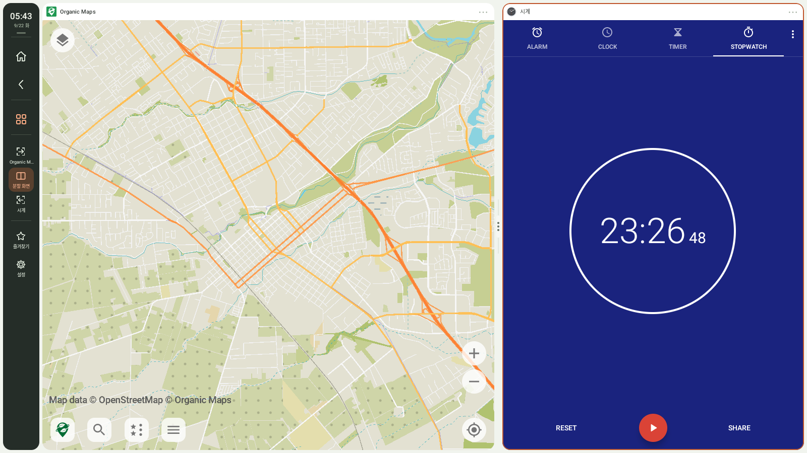
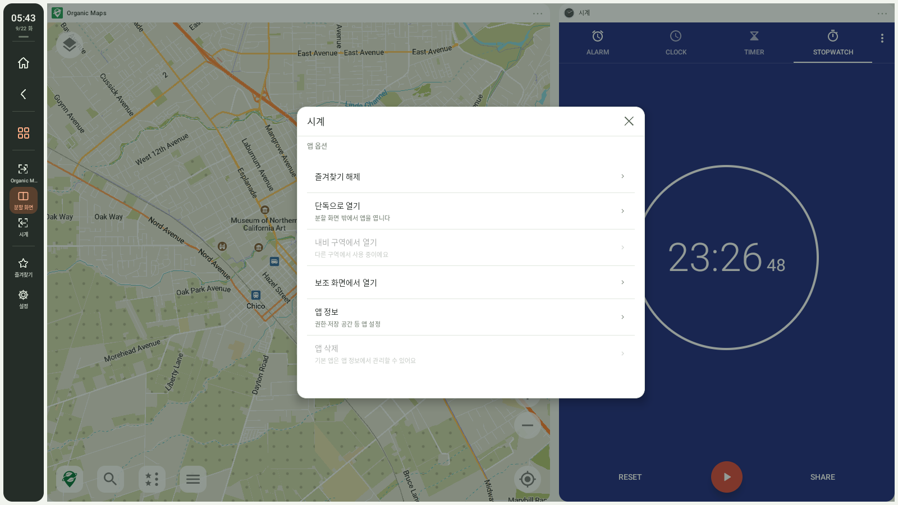
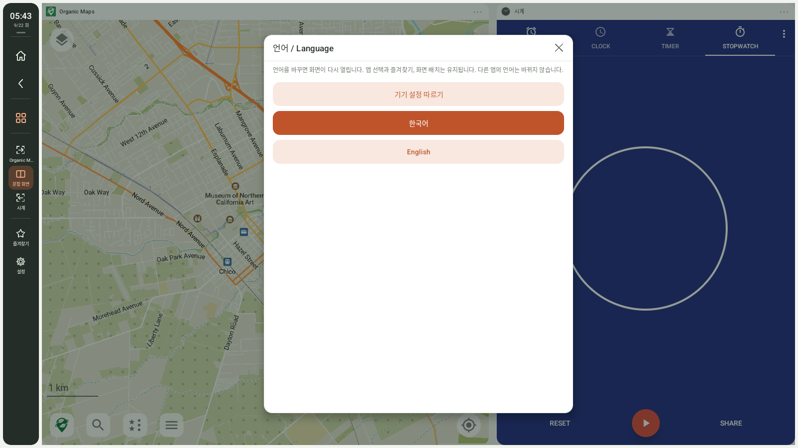
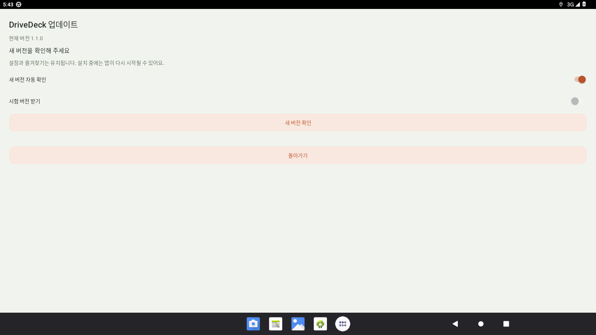

# DriveDeck

### 지도는 계속 보고, 옆에서는 원하는 앱을.

**한국어** · [English](README.en.md)

DriveDeck은 Android 차량용 기기에서 내비게이션과 다른 앱을 나란히 사용하는 런처입니다. 실제 설치된 앱을 두 구역에 띄우고, 화면 전환·즐겨찾기·홈 조합·주야간 테마를 한곳에서 조작합니다.

[**1.0.1 APK 다운로드**](https://github.com/bajohy-totb/drivedeck-releases/releases/download/v1.0.1/DriveDeck-1.0.1.apk) · [배포 기록](https://github.com/bajohy-totb/drivedeck-releases/releases) · [전체 사용 설명서](docs/guide.ko.md)

**1.0.1 정식:** 자체 무선 디버깅·루트·Shizuku 연결을 지원합니다. 연결 대기와 재시도를 개선하고, 물리 키보드 포커스 보호·뒤로가기 연타 처리·분할 크기 자동 복구를 포함합니다. [처음 연결하기](docs/guide.ko.md#자체-연결-101)

> **1.0.1 GitHub 정식 배포.** 기존 1.0.0과 1.0.1 RC 위에 설치할 수 있는 배포용 APK입니다. 실제 차량 호환성과 알려진 제한은 [검증 기록](docs/validation.md)을 확인하세요.

*실제 Android 13 에뮬레이터 화면입니다. Organic Maps와 Android 시계는 별도 앱이며 DriveDeck에 포함되지 않습니다. 각 앱의 언어는 자체 설정을 따릅니다. 차량 화면이나 주행 검증을 나타내는 이미지가 아닙니다.*

## 주요 기능

| 기능 | 할 수 있는 일 |
|---|---|
| 두 앱 나란히 | 내비와 앱 1을 독립된 구역에서 실행하고 터치합니다. |
| 화면 전환 | 내비 크게, 2분할, 앱 1 크게를 바로 전환합니다. |
| 비율 조절 | 3:7~7:3 비율을 선택하거나 구분선을 길게 눌러 조절합니다. |
| 앱 선택 | 전체·즐겨찾기·최근 필터로 앱을 찾습니다. |
| 길게 누르기 | 즐겨찾기 추가/해제, 단독 열기, 구역 열기, 앱 정보, 삭제를 선택합니다. |
| 홈 조합 | 지금 사용하는 두 앱을 홈 기본으로 저장합니다. |
| 화면 설정 | 주야간 테마, 조작 바 위치, 즐겨찾기 바, 앱·키보드 배율을 바꿉니다. |
| 미디어·내비 안내 | 권한과 앱 지원 범위 안에서 재생 제어와 내비 알림 안내를 표시합니다. |
| 한국어·영어 | 기기 언어를 따르거나 DriveDeck 언어만 직접 선택합니다. |
| 앱 내 업데이트 | 정식·시험 버전 채널에서 새 버전을 받고 Android 설치 화면에서 확인합니다. |
| 백업·복원 | 앱 선택, 홈 조합, 배치, 즐겨찾기, 테마를 파일로 보관합니다. |
| 진단·복구 | 연결 재시도, 구역 다시 열기, 진단 저장, 시작 실패 복구를 제공합니다. |

## 앱을 길게 누르면

즐겨찾기 바와 앱 목록에서 같은 옵션을 사용합니다. **즐겨찾기 해제는 앱을 삭제하지 않습니다.** 앱 삭제는 Android 확인창을 거칩니다. 시스템 기본 앱은 앱 정보에서 관리합니다. **단독으로 열기**는 분할 화면 밖에서 앱 자체 화면을 엽니다.

## 한국어 / English

**설정 → 기기 → 언어 / Language**에서 기기 설정 따르기, 한국어, English를 선택합니다. 언어를 바꾸면 화면이 다시 열리며 저장한 앱 선택·즐겨찾기·배치는 유지됩니다. Android의 앱별 언어 설정과도 연동됩니다. 다른 앱의 화면·지도·곡명·알림 내용은 번역하지 않습니다.

## 설치와 업데이트

1. **Android 13 이상**이 필요합니다. 자체 무선 디버깅·루트·Shizuku 중 기기에 맞는 연결을 선택합니다. 제조사별 화면·입력 구현에 따라 호환성이 다를 수 있습니다.
2. APK를 받아 기존 DriveDeck 위에 설치합니다. 업데이트하려고 앱이나 설정을 먼저 지울 필요는 없습니다.
3. 위 안내에 따라 자체 연결을 페어링하거나 루트·Shizuku를 설정합니다. 기본 런처 지정은 설정에서 선택할 수 있습니다.
4. **설정 → 기기 → 업데이트**에서 새 버전을 확인합니다. 정식 버전은 **시험 버전 받기**를 꺼도 받을 수 있습니다. RC7부터 앱 내 업데이트를 지원합니다.
5. 다운로드 후 설치를 누릅니다. Android에서 DriveDeck의 앱 설치 허용을 요청하면 허용 후 돌아와 설치를 다시 누릅니다.

자동 확인은 런처 실행·복귀 시 동작합니다. 정상 확인 후에는 6시간, 인터넷 등의 문제로 실패한 뒤에는 5분이 지나야 다시 자동 확인합니다. **새 버전 확인**은 직접 바로 실행할 수 있습니다. 다운로드와 Android 설치 확인은 직접 진행합니다. 정식·시험 채널 모두 이번 1.0.1 정식을 받습니다. 주차한 뒤 설치해 주세요.

## 더 알아보기

- [전체 사용 설명서: 초기 설정, 모든 메뉴, 권한, 백업, 문제 해결](docs/guide.ko.md)
- [English guide](docs/guide.en.md)
- [한국어·영어 화면 모음](docs/screenshots.md)
- [검증 범위와 알려진 제한](docs/validation.md)

이 저장소는 **설치 파일·업데이트 안내·사용 설명서 배포용**입니다. DriveDeck의 원본 소스와 서명 키는 포함하지 않습니다. LGPL 라이브러리의 해당 소스와 교체용 재링크 자료는 각 배포의 `relink.zip` 파일에서 제공합니다.
