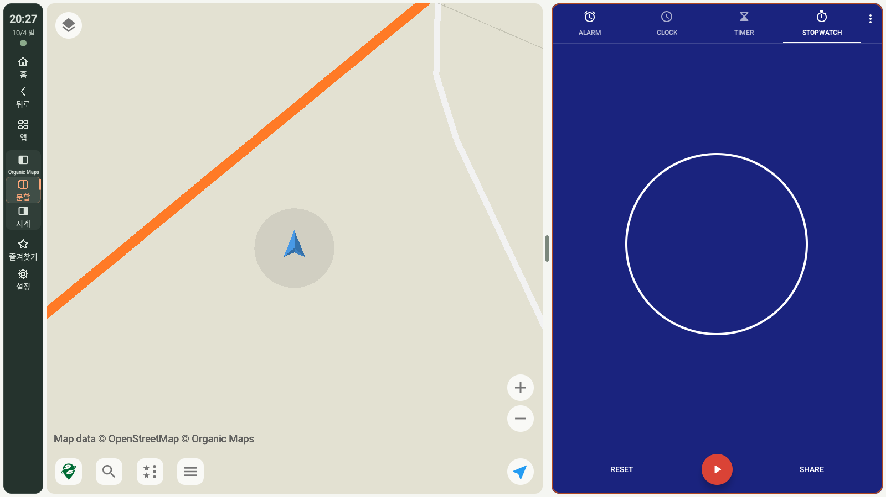
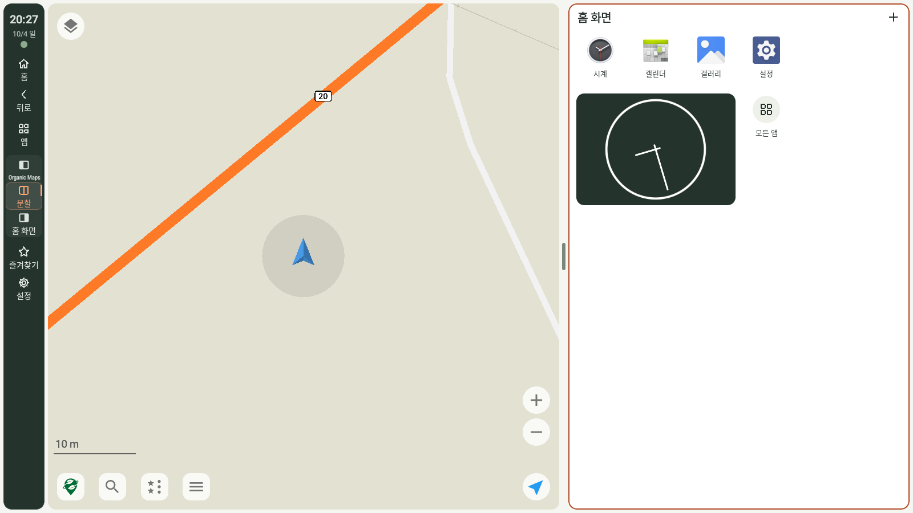
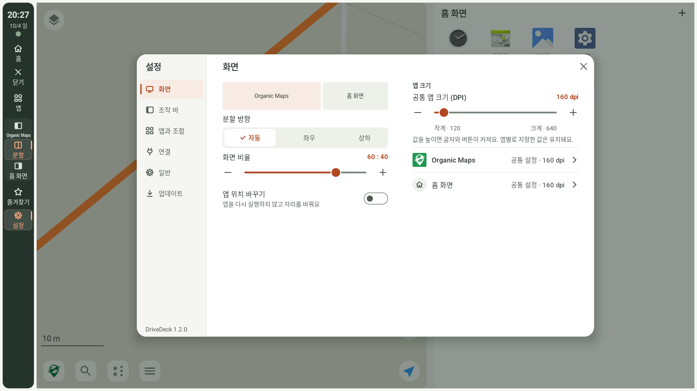

# DriveDeck

### 지도는 계속 보고, 옆에서는 원하는 앱을.

**한국어** · [English](README.en.md)

DriveDeck은 Android 차량용 기기에서 설치된 앱 두 개를 함께 사용하는 런처입니다. 가로로 긴 화면은 좌우로, 세로 화면은 위아래로 배치하고 조작 바에서 한 앱을 크게 볼 수 있습니다.

실행 중에는 시작할 때의 화면 방향을 고정합니다. 분할 방향과 조작 바 위치는 설정에서 바꿀 수 있습니다.

[**1.2.1 APK 다운로드**](https://github.com/bajohy-totb/drivedeck-releases/releases/download/v1.2.1/DriveDeck-1.2.1.apk) · [배포 기록](https://github.com/bajohy-totb/drivedeck-releases/releases) · [전체 사용 설명서](docs/guide.ko.md)

**1.2.1 정식:** 홈 화면에서 다른 구역 앱의 위젯을 누르면 드물게 그 앱이 다시 시작되던 문제를 고쳤고, 앱을 연달아 바꿀 때 한동안 열리지 않던 문제를 줄였습니다. **1.2.0부터:** 홈 버튼을 누르면 내비 앱은 그대로 두고 옆 구역에 홈 화면을 엽니다. 홈 화면에는 앱 아이콘과 시계·날씨·음악 같은 Android 위젯을 올립니다. 내비 앱이든 보조 앱이든 입력란을 누르면 그 앱에 키보드가 바로 열립니다. 지도의 검색창에도 그대로 입력합니다. 화면 전체를 새 디자인으로 다시 만들었습니다. 조작 바의 모든 버튼에 이름이 붙었고 설정은 여섯 분류의 줄 목록입니다. 화면 비율 패널에는 두 앱을 다시 실행하지 않고 자리를 바꾸는 ‘위치 바꾸기’ 버튼이 있습니다. 기본 홈을 지정해 둔 사용자는 홈 버튼이 이전처럼 기본 홈을 열며, 설정 → 앱과 조합 → 홈 버튼에서 바꿀 수 있습니다. 보호 영상 호환 모드의 실제 넷플릭스 재생은 아직 확인하지 못했습니다. 기존 앱 위에 설치하면 설정을 유지합니다. Android 13 이상과 자체 무선 디버깅·루트·Shizuku 중 하나의 연결이 필요합니다. 실제 엠스틱4와 갤럭시 Z 폴드8로는 아직 확인하지 못했습니다.

*실제 Android 13 에뮬레이터 화면입니다. 지도 앱과 옆의 앱은 따로 설치한 앱이며 DriveDeck에 포함되지 않습니다. 차량·주행 시험 사진은 아닙니다. [검증 범위와 제한](docs/validation.md)*

## 주요 기능

아래 기능은 정식 1.2.1 기준입니다. [앱 크기·앱 목록·조합 사용법](docs/preview.ko.md)도 확인하세요.

| 기능 | 할 수 있는 일 |
|---|---|
| 홈 화면과 위젯 | 홈 버튼으로 보조 구역에 홈 화면을 엽니다. +로 위젯이나 앱을 올리고, 길게 눌러 옮기거나 뺍니다. ‘모든 앱’에서 고른 앱은 그 구역에 열립니다. |
| 어느 앱에서나 키보드 | 입력란을 누른 앱에 키보드가 열립니다. 마지막으로 누른 구역이 입력을 받고, 다른 구역을 끌거나 확대해도 입력 대상은 바뀌지 않습니다. |
| 화면을 넓게 | 상단 전체 바 없이 앱을 표시합니다. 앱 이름 바는 필요할 때 켭니다. |
| 가로·세로 배치 | 자동·좌우·상하 분할, 앱 위치 바꾸기, 왼쪽·오른쪽·아래 조작 바를 선택합니다. |
| 앱 크게 보기 | 조작 바의 앱 이름 버튼으로 한 앱을 크게, 분할 버튼으로 두 앱을 함께 봅니다. |
| 구분선과 화면 비율 | 구분선을 끌어 5% 단위로 비율을 미리 보고 손을 놓아 적용합니다. 30~70% 범위입니다. 누르면 화면 비율 패널이 열리고 ‘위치 바꾸기’로 두 앱의 자리를 바꿉니다. |
| 앱 목록 | 분류·검색과 화면에 맞는 격자, 위아래 스크롤로 앱을 찾습니다. |
| 앱 옵션 | 앱을 길게 눌러 즐겨찾기, 구역에서 열기, 단독으로 열기, 앱 크기 (DPI), 보호 영상 호환 모드, 앱 정보, 앱 삭제를 선택합니다. |
| 즐겨찾기 | 별 버튼으로 최대 3개의 바로가기와 전체 보기를 엽니다. 실행 대상은 자동 분류 또는 선택한 구역으로 설정합니다. |
| 저장한 조합 | 설정 → 앱과 조합 → 앱 조합에서 최대 8개를 편집합니다. 조합 하나를 기본 홈으로 지정할 수 있습니다. |
| 설정 | 화면·조작 바·앱과 조합·연결·일반·업데이트를 왼쪽에서 고릅니다. 메뉴 위치는 오른쪽·가운데·아래 중에서 선택합니다. 홈 버튼을 길게 눌러도 열립니다. |
| 입력·복구 | 물리 키보드 입력, 조작 바의 키보드 포커스 방지, 연결 재시도, 구역 크기 복구, 커진 구역의 지도 다시 그리기를 지원합니다. |
| 한국어·영어 | 기기 언어를 따르거나 앱 언어를 직접 선택합니다. |
| 업데이트·백업 | 정식/시험 채널에서 APK를 받고 Android에서 설치를 확인합니다. 배치와 즐겨찾기, 저장한 조합을 백업합니다. |

**즐겨찾기 해제와 홈에서 빼기는 앱을 삭제하지 않습니다.** 앱 삭제는 Android 확인 창을 거칩니다. 기본 앱은 앱 정보에서 관리합니다. 단독으로 열기는 분할 화면 밖에서 해당 앱을 실행합니다.

## 홈 화면

*실제 Android 13 에뮬레이터 화면입니다. 지도와 위젯은 따로 설치한 앱이 제공하며 DriveDeck에 포함되지 않습니다. 차량·주행 시험 사진은 아닙니다.*

**+**를 눌러 위젯이나 앱을 추가합니다. 올린 것을 길게 눌러 끌면 자리를 옮기고, 위쪽 막대에 놓으면 홈에서 뺍니다. 길게 누른 뒤 그대로 떼면 옵션이 열리며 위젯은 가로·세로 칸 단위로 크기를 조절합니다. 앱을 연 뒤 홈을 다시 누르면 홈 화면으로 돌아옵니다. 자세한 내용은 [사용 설명서의 홈 화면](docs/guide.ko.md#3-홈-화면)에 있습니다.

## 설정과 언어

**설정 → 일반 → 언어 / Language**에서 기기 설정 따르기·한국어·English를 선택합니다. 앱 선택과 배치를 유지하며 Android 앱별 언어 설정과 연동합니다. 다른 앱의 지도·곡명·알림 원문은 번역하지 않습니다.

## 설치와 업데이트

1. **Android 13 이상**에서 APK를 기존 DriveDeck 위에 설치합니다.
2. 처음 사용한다면 [자체 연결·루트·Shizuku 안내](docs/guide.ko.md#1-시작하기)에 따라 연결하고 서로 다른 앱 두 개를 선택합니다.
3. **설정 → 업데이트 → 업데이트**에서 새 버전을 확인하고 다운로드합니다.
4. 업데이트 설치를 누르면 Android 설치 확인창이 열립니다. 앱 설치 허용이 필요하면 허용하고 돌아와 다시 누릅니다.

자동 확인은 앱 실행·복귀 시 정상 확인 후 6시간, 실패 후 5분 간격으로 가능합니다. 수동 확인은 바로 할 수 있습니다. 다운로드와 설치 확인은 직접 진행합니다. 정식 채널은 1.2.1, 시험 채널은 1.3.0-rc6(새 이름 M4 Launcher와 새 아이콘, 새 홈 화면: 자유 배치, 여러 페이지, 하단 바, 폴더, 배경, 쓸어 올리는 앱 목록)를 제공합니다. 주차 후 설치하세요.

## 더 알아보기

- [전체 사용 설명서](docs/guide.ko.md)
- [한국어·영어 화면 모음](docs/screenshots.md)
- [검증 기록과 차량 호환성 제한](docs/validation.md)

이 저장소는 설치 파일·업데이트 안내·문서 배포용입니다. 앱 원본 소스와 서명 키는 포함하지 않습니다. LGPL 라이브러리의 해당 소스와 교체용 재링크 자료는 같은 버전 배포의 `DriveDeck-1.2.1-relink.zip`에 제공합니다.
