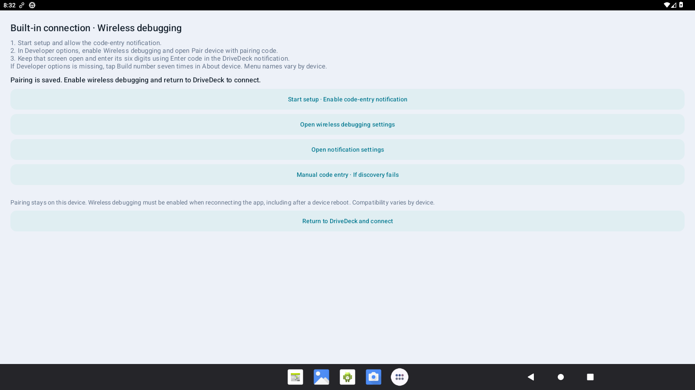
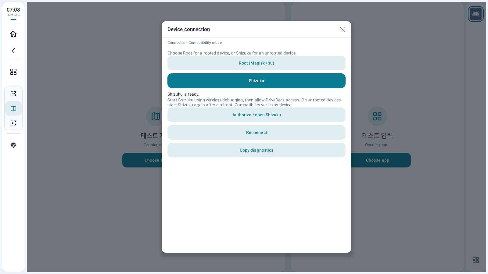
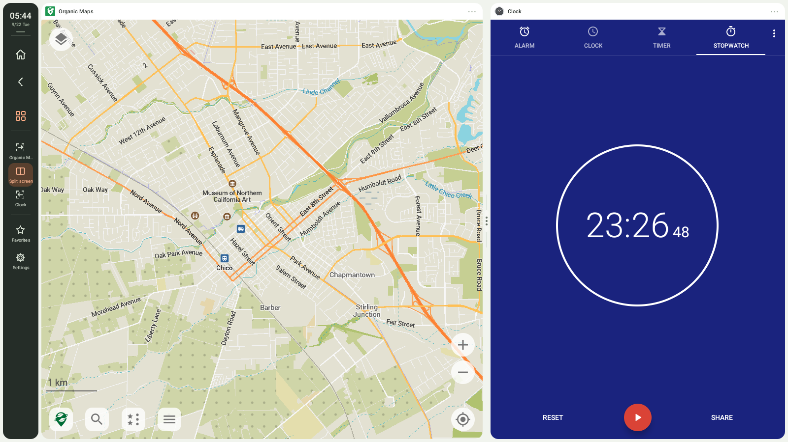
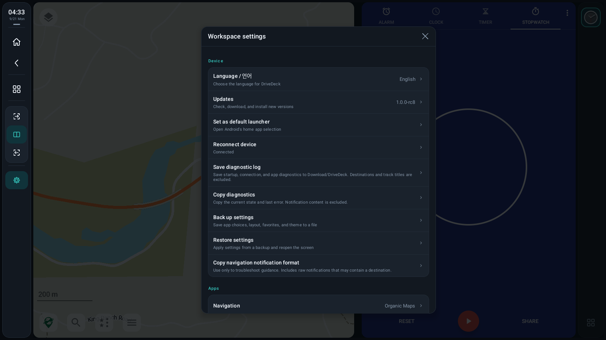

# DriveDeck user guide

[Home](../README.en.md) · [한국어](guide.ko.md) · **English**

## 1. Getting started

The stable 1.0.0 release requires Android 13 or newer with root access. Install the APK, open DriveDeck, and allow the root connection. Select an installed app for navigation and another for App 1. The same app cannot be assigned to both panes.

### Built-in connection preview (1.0.1-rc5)

Connect directly through Android wireless debugging. This is the default for a new installation; upgrades retain the existing connection method.

1. Connect to Wi-Fi and open **Settings → Device → Connection method → Built-in connection → Built-in connection setup** in DriveDeck.
2. Tap **Start setup · Enable code-entry notification** and allow notifications.
3. In Android Developer options, enable **Wireless debugging** and open **Pair device with pairing code**. If Developer options is missing, tap Build number seven times in About device. Menu names vary by manufacturer.
4. Keep the code screen open, pull down notifications, and enter its six digits using DriveDeck's **Enter code** action. Leaving Android Settings may expire the code.
5. After the completion notification, return to DriveDeck and choose apps for both panes.

Pairing stays on this device and is excluded from layout backups. Wireless debugging must be enabled when reconnecting the app. After a reboot, Wi-Fi change or deleting the pairing in Android, you may need to enable wireless debugging or pair again. If your device lacks wireless debugging, use Root or Shizuku.

For an incorrect code, dismiss Android's failure dialog, open a new code screen and retry. If discovery fails, manual code and pairing-port entry is available while keeping the system code screen open. The pairing port is the number after the colon on that screen.

See the [validation scope](validation.md) for actual-device limitations. Library notices, corresponding source and replacement materials are provided in the [same release's relink ZIP](https://github.com/bajohy-totb/drivedeck-releases/releases/tag/v1.0.1-rc5).

### Physical keyboards (1.0.1-rc5)

Connect a USB or Bluetooth keyboard, then tap a **text field in App 1**. Navigation touches preserve App 1 as the typing destination. Input works in App 1 fullscreen and split layouts. Settings and the app picker receive input while open; closing them returns input to App 1.

**The sidebar and favorites bar never receive keyboard focus.** Tab and cursor keys cannot select their buttons, including while menus are open. Use touch and long press to operate the bars.

Text, cursor keys, deletion, Home/End and modifiers such as Ctrl and Shift are routed to App 1. Actual shortcuts and language switching depend on the app, Android keyboard settings and IME. See the [validation record](validation.md) for hardware and vehicle coverage.

### Shizuku preview (1.0.1-rc1)

Unrooted Android 13+ devices can select Shizuku in 1.0.1-rc1.

1. Install [official Shizuku](https://shizuku.rikka.app/download/) 13 or newer, pair using wireless debugging, and start it.
2. In DriveDeck, select **Settings → Device → Connection method → Shizuku**.
3. Tap **Authorize / open Shizuku**, then allow DriveDeck access.
4. Choose different apps for the two panes. If Shizuku stops, start it again to reconnect automatically.

Start Shizuku again after a device reboot. DriveDeck explains missing startup or authorization and does not repeatedly open permission prompts during automatic retries. The connection choice stays on this device and is excluded from layout backups. APK installation permission is separate from Shizuku authorization. Manufacturer display/input compatibility remains subject to the [validation scope](validation.md).

Choose **Settings → Device → Set as default launcher** to use DriveDeck as Android's Home app. When it opens automatically depends on the device's boot and Home behavior. To return to another launcher, change the default Home app in Android settings.

## 2. Controls and layouts

| Control | Action |
|---|---|
| Home | Return to the split layout. Restore the saved app combination if a Home preset exists. |
| Back | Close the chooser or menu first; otherwise send Back to the selected pane's app. |
| App chooser | Select the Navigation / App 1 target and All / Favorites / Recent filter. |
| Expand navigation | Fill the area beside the controls with navigation. |
| Split screen | Show navigation and App 1 side by side. |
| Expand App 1 | Fill the area beside the controls with App 1. |
| Settings | Open device, apps, Home, display, split ratio, scale, and status settings. |

Use App 1 for typing and the keyboard. You can pan and zoom the navigation pane by touch, but it is not a keyboard input target. Expanding one pane stops display output from the hidden pane; it does not force-stop the other app's background work, such as a music service.

Tap the divider for ratio choices, or hold and drag it sideways. A guide previews the split; releasing applies it. Navigation can occupy 30–70% of the split area.

Version 1.0.1-rc5 discards expired Back taps instead of delivering a delayed burst. Layout changes during app creation and later geometry mismatches are corrected to the current pane dimensions. Increase **App and keyboard scale** for larger text and controls; density scaling is separate from the pane’s physical pixel dimensions.

## 3. Favorites and app options

Hold an icon in the app chooser or favorites bar.

| Option | Action |
|---|---|
| Add / Remove favorite | Change the shortcuts beside App 1. This does not uninstall the app. |
| Open separately | Use the app's own screen outside the split layout. The pane is restored when you return. |
| Open in navigation / App 1 | Assign that pane. Apps already used in the other pane cannot be duplicated. |
| App info | Open that app's Android permissions, storage, and other settings. |
| Uninstall app | Open Android's uninstall confirmation. Manage built-in apps through App info. |

**Settings → Apps → Manage pane** also provides Change app, Reopen, Reconnect display, Open separately, Save/Copy diagnostics, and Clear this pane. Clearing a pane removes its selection, not the installed app. Some video or protected-content apps can show black screens or close in a pane; try opening them separately.

## 4. Make it yours

- **Home button:** Save or clear the current app combination. Apps already in the correct panes are not unnecessarily relaunched.
- **Automatic day/night theme:** Follow the device's night mode, with a time-of-day fallback when no valid signal is available. Turn automatic mode off to select the night theme manually.
- **Controls on the right:** Move the controls to suit the driver's position or your preference.
- **Favorites bar:** Show or hide favorites beside App 1.
- **App and keyboard scale:** Adjust pane display density from 120 to 240 dpi. Apps may reconfigure their screens when this changes.
- **Device temperature:** Show a readable CPU/SoC sensor in the controls. No invented temperature is shown if sensor access is unavailable.

## 5. Language

Open **Settings → Device → Language / 언어** and choose **Follow device settings / 한국어 / English**. You can also change the language in Android's DriveDeck app settings. Unsupported device languages fall back to English.

Android persists the language selection. App choices, favorites, and layout survive screen recreation. Maps, music, app names, and notification content remain as supplied by their respective apps. Changing DriveDeck's language does not change other apps' languages.

## 6. Media and navigation guidance

Open **Settings → Apps → Media controls** to allow notification access. When a music app provides a playback session and supports the command, you can play/pause, skip to the next track, and open the playing app. Unsupported commands are disabled. Your music app remains in its selected pane.

If your navigation app supplies an ongoing guidance notification, DriveDeck can display it in a guidance strip while the navigation pane is hidden. Notification formats vary; not every navigation app is supported. This strip is separate from guidance provided by the navigation app itself.

## 7. Updates

Use **Settings → Device → Updates** to check, download, and install. Turn **Receive preview versions** off for stable 1.0.0, or on for Shizuku preview 1.0.1-rc1. RC7 already includes this menu; earlier versions need one manual APK installation first. Switching back to stable after installing a preview does not automatically downgrade the app.

A download continues after leaving its screen while the app process remains alive. Incomplete downloads are discarded after process termination and must be restarted. Completed files are verified again and restored after a restart. The updater checks size, SHA-256, package, version, Android compatibility, and signature. Reinstalls, downgrades, and files signed with another key are rejected.

Changing channels discards the saved file from the previous channel. Automatic checks run on launcher start/resume, at least six hours after the previous check. Downloading and confirming installation remain manual.

## 8. Backup, diagnostics, and recovery

**Back up settings** exports app choices, Home preset, layout, split ratio, scale, favorites, recent apps, and theme to JSON. **Restore settings** validates the file, applies its settings, and reopens the screen. Installed apps, root/notification/install permissions, and the Android-managed app language are not included in the backup file.

**Save diagnostic log** writes startup, connection, and app diagnostics to Download/DriveDeck. Normal diagnostics exclude raw notifications, destinations, and track titles. **Copy navigation notification format** deliberately copies raw content and warns that a destination may be included. Diagnostics are saved or copied on your request, not automatically uploaded to this repository. Update checks and downloads connect to GitHub.

After repeated startup failures or a detected previous crash, **Safe mode** offers a normal restart, opening without launching apps, clearing pane selections, resetting settings, choosing another launcher, updates, and diagnostic export. Resetting removes settings, so back them up first.

## 9. Troubleshooting

| Symptom | What to check |
|---|---|
| Lost connection / empty panes | Depending on the selected connection method, check root authorization or that Shizuku is running and DriveDeck is authorized, then reconnect. Manufacturer compatibility and previously reported issues remain under investigation. |
| Black screen or app closes | Try Open separately. The app may restrict external displays or protected content. |
| No keyboard | Use App 1 and check that an Android keyboard is installed and enabled. |
| No media controls | Check notification access and an active playback session in the music app. |
| No update available | Select Check for updates and check the installed version and channel. Shizuku support is on preview; the same or an older version is not offered as an update. |
| Installation blocked | Check install permission for DriveDeck, storage, Android version, and matching signatures. |
| Freeze when muting in the vehicle | This has not been confirmed resolved. See [validation and limitations](validation.md). |

Every app, vehicle, and manufacturer combination has not been verified. See the [screenshot gallery](screenshots.md) and [release history](https://github.com/bajohy-totb/drivedeck-releases/releases).
