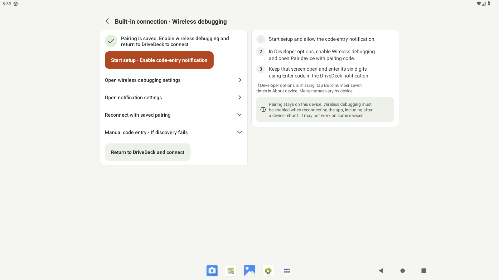
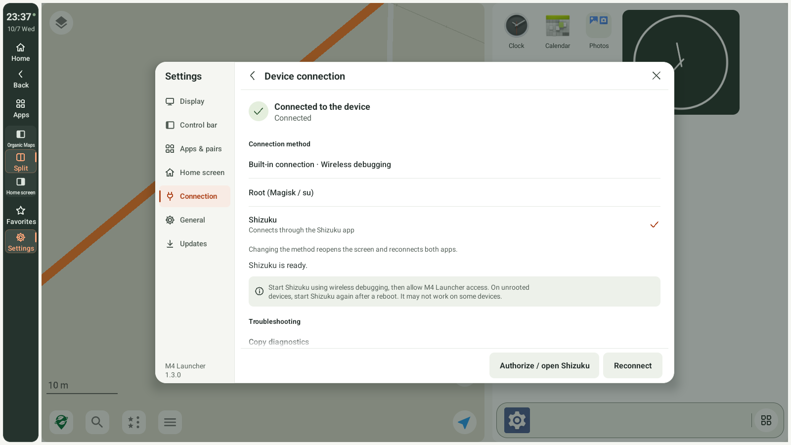
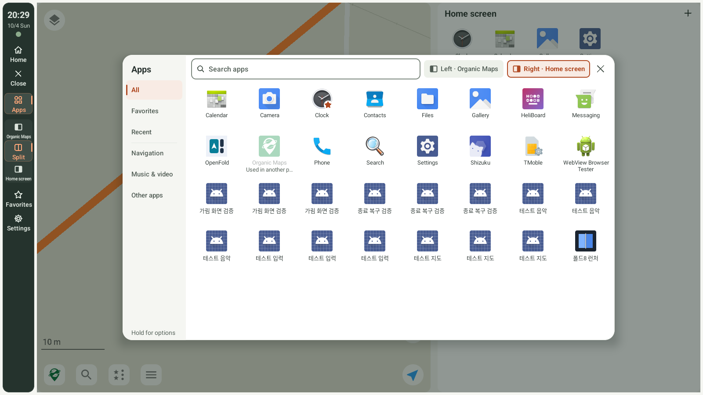
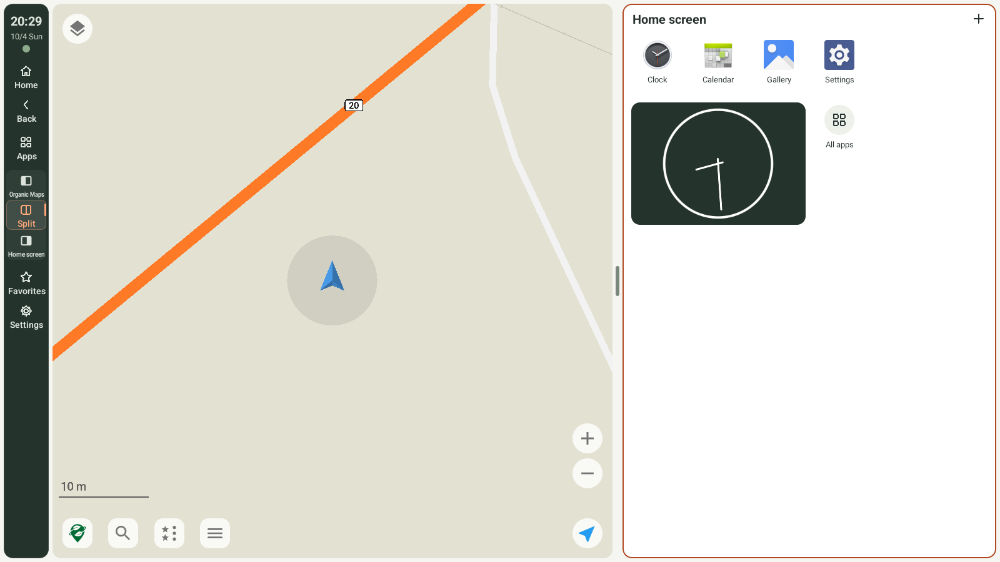
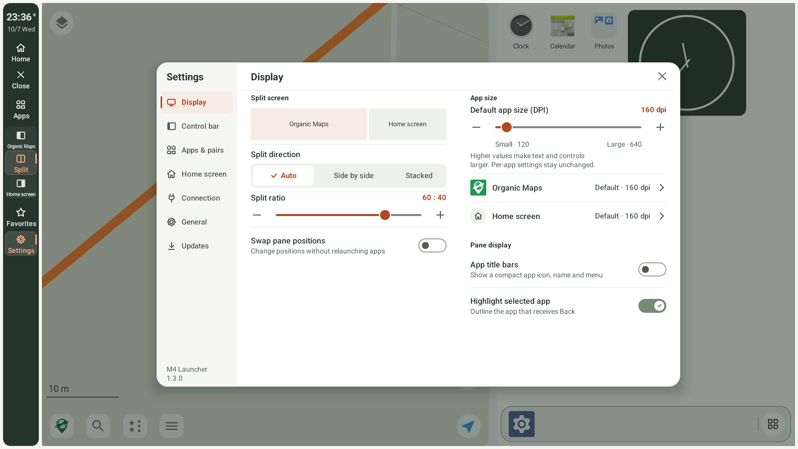

# M4 Launcher user guide

[Overview](../README.en.md) · [한국어](guide.ko.md) · **English**

This guide describes **stable 1.3.0**. **Home opens the home screen; hold Home for Settings.** If you set a default home, a tap on Home goes there instead. See also [app size, app list and pair editing](preview.en.md).

## 1. Getting started

M4 Launcher 1.3.0 supports Android 13 or newer with built-in wireless debugging, Root or Shizuku. Install the APK (the file is still named `DriveDeck-1.3.0.apk`) and configure the connection your device supports. Then choose a navigation app and a secondary app, with **Choose app** in an empty pane or **Apps** on the control bar. The same app cannot be assigned to both panes.

### Built-in connection

Connect directly through Android wireless debugging, with no other app. This is the default for a new installation; upgrades retain the existing connection method.

1. Connect to Wi-Fi. In M4 Launcher, open **Settings → Connection → Connection method**, choose **Built-in connection · Wireless debugging**, then open **Built-in connection setup**. The setup is a full screen of its own.
2. Tap **Start setup · Enable code-entry notification** and allow notifications.
3. In Android Developer options, enable **Wireless debugging** and open **Pair device with pairing code**. If Developer options is missing, tap Build number seven times in About device. Menu names vary by manufacturer.
4. Keep the code screen open, pull down notifications, and enter its six digits using **Enter code** in the M4 Launcher notification. Leaving Android Settings may expire the code.
5. After the completion notification, return to M4 Launcher and choose apps for both panes.

Pairing stays on this device and is excluded from settings backups. Wireless debugging must be enabled when reconnecting the app. After a reboot, Wi-Fi change or deleting the pairing in Android, you may need to enable wireless debugging or pair again. If your device lacks wireless debugging, use Root or Shizuku.

In Android's list of paired devices a new pairing appears as M4 Launcher. A pairing made earlier, under the name DriveDeck, keeps that name and keeps working.

For an incorrect code, dismiss Android's failure dialog, open a new code screen and retry. If discovery fails, enter the code and the pairing port under **Manual code entry · If discovery fails** while keeping the system code screen open. The pairing port is the number after the colon on that screen.

See the [validation scope](validation.md) for actual-device limitations. Library notices, corresponding source and replacement materials are provided in the [same release's relink ZIP](https://github.com/bajohy-totb/drivedeck-releases/releases/tag/v1.3.0).

### Root connection

On a rooted device, choose **Root (Magisk / su)** under **Settings → Connection → Connection method**. If the root request was refused or left unanswered, tap **Reconnect** to be asked again.

### Shizuku connection

Unrooted Android 13+ devices can select Shizuku.

1. Install [official Shizuku](https://shizuku.rikka.app/download/) 13 or newer, pair using wireless debugging, and start it.
2. In M4 Launcher, select **Settings → Connection → Connection method → Shizuku**.
3. Tap **Authorize / open Shizuku**, then allow M4 Launcher access.
4. Choose different apps for the two panes. If Shizuku stops, start it again to reconnect automatically.

Start Shizuku again after a device reboot. M4 Launcher explains missing startup or authorization and does not repeatedly open permission prompts during automatic retries. The connection choice stays on this device and is excluded from settings backups. APK installation permission is separate from Shizuku authorization. Manufacturer display/input compatibility remains subject to the [validation scope](validation.md).

While the selected method still needs setup, the main button of the connection screen opens that setup instead of **Reconnect**.

Choose **Settings → General → Set as default launcher** to use M4 Launcher as Android's Home app. When it opens automatically depends on the device's boot and Home behavior. To return to another launcher, change the default Home app in Android settings.

## 2. Controls and layouts

Every button on the control bar has a label.

| Button | Action |
|---|---|
| Home | Tap to open the [home screen](#3-home-screen) in the secondary pane. If the Home button is set to Default home, it runs your default home instead. Hold to open Settings. |
| Back | Close a dialog, menu or the app list first. Inside Settings, go one step back, from what a row opened to its page; on a page, close Settings. Otherwise send Back to the selected pane's app. |
| Apps | Open the app list. Select a target pane, then find an app using filters, search and scrolling. |
| Navigation app's name | Fill the area beside the control bar with the navigation app. Hold to open the app list for that pane and choose another app. |
| Split | Show both apps along the selected split direction. Hold to open **Split screen**: a row for each pane to change its app, **Swap pane positions**, **Split ratio** and **App pairs**. |
| Secondary app's name | Fill the area beside the control bar with the secondary app. Hold to open the app list for that pane and choose another app. |
| Favorites | Open the quick favorites popup. |
| Settings | Open Display, Control bar, Apps & pairs, Home screen, Connection, General and Updates. A dot marks the button when a new version is available. |

A control bar at the left or right also shows, above its buttons, the time, the date and the chip temperature, as far as the screen's height allows. The connection state is a small sign beside the clock: a green dot when connected, a ring while connecting, a triangle when the connection is down. On a low screen the date gives way first and the eight buttons get a little lower together; then the temperature goes, then the clock. No button is cut. Only a screen too low even for that makes the control bar scroll. A control bar at the bottom shows the buttons only.

The chip temperature is the middle value of the CPU sensors. It turns orange at 85°C and back below 82°C. Hold the clock to see the middle value, the highest sensor and its name. No temperature is shown when no sensor can be read. With a large system font the clock, the date and the temperature are fitted to the bar's width instead of being cut.

In a split, the pane that Back and the pane menus act on is marked by a thin edge and a short accent tab at the middle of its top. Switch the mark off with **Settings → Display → Highlight selected app**.

Expanding one pane stops display output from the hidden pane; it does not force-stop the other app's background work, such as a music service.

### Split ratio and Swap positions

Tap the divider to open the **Split ratio** panel. Choose one of five ratios from 30 : 70 to 70 : 30. The numbers read in screen order (left and right, or top and bottom). **Swap positions** in the panel swaps the two apps without restarting them. Holding **Split** on the control bar leads to the same panel through **Split ratio**.

Drag the divider to preview a ratio in 5% steps; releasing applies it. Devices with a vibration motor give a short tick at each step. The range is 30–70%.

Expired Back taps are discarded instead of being delivered as a delayed burst. Layout changes during app creation and later size mismatches are corrected to the current pane dimensions. Increase **Settings → Display → Default app size (DPI)** for larger text and controls; app size is separate from the pane's physical pixel dimensions.

When a pane grows (for example from split to expanded) and the navigation app keeps drawing at the old size with black around it, the pane's output is switched off and on a few seconds later (about 3–5 s) so the app draws at the new size. The app is not closed, so a route is kept. This applies only to the navigation pane and is tried at most twice per resize. The same repair is used when an app that locks its orientation is shown narrow in the middle of the pane on a near-square screen. Not yet checked with the real KakaoNavi.

## 3. Home screen

*Actual Android 13 emulator capture. The map and the widgets come from separately installed apps, not from M4 Launcher. This is not an in-vehicle or driving-test image.*

The Home button keeps the navigation app and opens the **Home screen** in the secondary pane. If one app was expanded, the layout returns to the split. Like an app in a pane, the home screen can be resized, swapped and expanded. It starts with your favorites and recently used apps. What was on the home screen of 1.2.1 is carried over in order.

The home screen is a grid of cells on one or more pages. An app or a folder takes one cell and a widget a block of cells, and each stays where you put it. Swipe sideways to turn the page; dots under the pages show which one is in view. A page with more rows than the pane shows scrolls up and down. The **dock** at the foot stays while the pages turn. It holds apps and folders, as many as the grid has columns, and has the **All apps** button at its end.

| Action | Result |
|---|---|
| Tap an app icon | Opens the app in that pane. Press Home again to return to the home screen; the app that was open stays behind it, as on a phone. |
| Hold and drag | Moves the item to another cell. Rest at the left or right edge to turn the page; past the last page a new one is made. Drop the item in the dock to keep it there, or on the **Drop here to remove** bar at the top to take it off the home screen. |
| Drop an app on an app | Makes a folder of the two. Drop an app on a folder to put it in; a folder holds up to 24 apps and says so when it is full. A folder dropped on an app trades places with it. |
| Tap a folder | Opens it. Tap its name to rename it. Hold an app inside and drag it to take it out, or onto the bar at the top to take it off the home screen. With one app left, the folder turns back into that app. |
| Hold and release without moving | Opens the item's options. An app has its shortcuts (see below), open in the other pane, **App options** and **Remove from home**. A folder has **Rename** and **Remove from home**. While the dock is shown, both also have **Move to dock** or, in the dock, **Move to a page**. A widget has **Resize** and **Remove from home**. An app in an open folder has **Move out of folder** as well. |
| Resize | A frame with a handle on each side stands around the widget. Drag a handle and the widget changes cell by cell, no smaller than its app allows. Touch anywhere else to finish. |
| Hold an empty spot | Opens a menu with **Add widget**, **Add app**, **Place an All apps button** and **Home screen settings**. With Add app, each app you tap in the list goes on the home screen until you close the list. An empty home screen shows an **Add** button for the same menu. |
| All apps | The button at the end of the dock opens the app list in that pane. A swipe up from the foot of the home screen pulls the same list up under your finger. Swipe down at the top of the list or press Back to send it down. The app you choose opens in that pane. Hold an app in the list for **Add to home** or **Remove from home**, and **App options**. |

**An All apps button of your own.** **Place an All apps button** puts a button for the app list on a cell. It is moved, put in the dock and removed like an app's icon. There can be one, and the menu no longer offers it once it is placed. It goes into no folder. With the dock switched off, the same menu has **All apps** to open the list.

**Home screen settings.** The menu opens a card over the lower part of the pane, so the home screen shows each change at once: **Background**, **Columns** (3 to 8), **Icon size** (Small, Medium, Large), **Show app names** and **Show dock**. The same controls are under **Settings → Home screen**. Many columns in a narrow pane make narrow cells.

**Backgrounds.** Choose **Plain**, **Forest**, **Dusk**, **Slate**, **Paper** or **My photo**. Plain follows the theme. On a dark background app names turn light, and at night every background is dark. A tap on **My photo** opens the system's picker on the launcher's whole screen, and the picture you choose becomes the background. A tap on My photo while it is the background changes the picture. The picture is copied into the launcher: the background stays when the original is deleted, and the launcher holds no permission to read your pictures. The photo is darkened so that app names can be read on it, a light photo more than a dark one. The device needs a file picker app for this; without one a notice says so.

**Shortcuts.** While M4 Launcher is the device's default home app (**Settings → General → Set as default launcher**), holding an app shows up to four of that app's shortcuts at the top of its options. Android gives shortcuts to the default home app only.

Widgets are added through the device connection, without Android's permission question. If that is not possible, Android asks for permission. A widget that needs setup first opens its own setup screen. Tapping a widget opens its app in the same pane. A widget stands on a page, not in the dock or in a folder, and goes at once when its app is removed. A widget that draws only light text on no background (a clock or weather widget made to sit on a wallpaper) is placed on a dark card, so it stays readable on a light background; a see-through widget with dark text gets a light card on a dark background. Which widgets exist, what they show and which sizes they support is decided by each app.

On dense screens the home screen is drawn at the launcher's own size; widget content keeps the app size of that pane. The home screen holds up to 80 items, and an app in a folder counts as one. **Remove from home does not uninstall an app.** On the home screen, **Back** only closes what is open over it: a folder, the app list, the widget list, the settings card or the resize frame. Pages are turned and widgets resized by touch; a screen reader can also turn pages, open the add menu and resize a widget cell by cell.

**If you use a default home:** if you had set a pair as default home, the Home button keeps returning to that pair. Choose what Home opens, **Home screen** or **Default home**, under **Settings → Home screen → Home button**. Setting a default home for the first time switches the button to Default home; clearing the default home makes it open the home screen again.

Not yet checked on the real 엠스틱4 and Galaxy Z Fold8.

## 4. Keyboard

### On-screen keyboard

Tap a text field in either app, navigation or secondary, and the keyboard opens in that app at once. This includes the map's search box; nothing has to be switched on first.

**The pane tapped last** takes the typing. Dragging or pinching the other pane (moving the map) does not take the keyboard away from the app you are typing in, and neither does a long press. While a launcher menu such as Settings or the app list is open, that menu receives input; closing it returns input to the pane tapped last.

### Physical keyboards

Connect a USB or Bluetooth keyboard, then tap a **text field in the app you want to type in**. As with the on-screen keyboard, the app in the pane tapped last receives the text, with one app expanded or in a split layout.

**The control bar and favorites popup never receive keyboard focus.** Tab and cursor keys cannot select their buttons, including while menus are open. Use touch and long press to operate the bars.

Text, cursor keys, deletion, Home/End and modifiers such as Ctrl and Shift are routed to that app. Actual shortcuts and language switching depend on the app, Android keyboard settings and IME. See the [validation record](validation.md) for hardware and vehicle coverage.

**Known limit:** with a hardware keyboard attached, the on-screen keyboard hidden and Android's own (AOSP) keyboard in use, a pane sometimes takes no touch after a text field in it was tapped. This was seen on the test emulator, has been there since 1.2.0, and has not been checked on a real unit. A saved diagnostic log has a line that tells whether it applies to your unit: whether a hardware keyboard is attached, whether the on-screen keyboard is hidden beside one, and the keyboard app.

## 5. Favorites and app options

Hold an icon in the app list or favorites popup. With app title bars switched on, the ⋯ button of a title bar opens the same options. On the home screen, hold an app and choose **App options**.

| Option | Action |
|---|---|
| Add to favorites / Remove from favorites | Change the shortcut list. This does not uninstall the app. |
| Open in navigation pane / secondary pane | Assign that pane. Apps already used in the other pane cannot be duplicated. |
| Open separately | Use the app's own screen outside the split layout. The pane is restored when you return. |
| App size (DPI) | Set text and control size for this app only. See the [guide](preview.en.md). |
| Protected video compatibility | See below. |
| App info | Open that app's Android permissions, storage, and other settings. |
| Uninstall app | Open Android's uninstall confirmation. Manage built-in apps through App info. |

Tap an app under **Settings → Connection → App status by pane** to open **Manage pane**: Change app, Reopen, Reconnect display, Open separately, Save diagnostic log, Copy diagnostics and Clear this pane. Clear this pane asks first and removes the selection, not the installed app. Some video or protected-content apps can show black screens or close in a pane; try opening them separately.

### Protected video compatibility

To address audio with black Netflix video in a split pane, M4 Launcher opens Netflix in a bounded window on the physical display. Devices without the legacy window-control method use Android freeform windows; freeform support is required and a system title bar may be visible. It does not remove secure-window/DRM flags or copy protected video. Hold an app and toggle **Protected video compatibility**. This mode uses the device display scale; App size (DPI) is not applied.

On Android 14 and later, switching between split and expanded moves the video window through the system's transition, so the window and its title bar move together. On Android 13, a newly opened video window that could stay invisible now shows, and Back right after the window was shown again no longer does nothing. The area around the video window shows the pane's own background.

Actual Netflix account playback and vehicle DRM output have not been verified; manufacturer multi-window support varies. Not yet checked on the real Galaxy Z Fold8 (Android 17) either. See the [validation scope](validation.md).

## 6. Make the layout yours

Use **Display, Control bar, Apps & pairs, Home screen, Connection, General and Updates** in the settings column. The column always stays. What a row opens (the connection method, the language, the icon packs, the app pairs and the pair editor, media controls, an app's size) is shown in the place of the page, and its back arrow returns to the page exactly where you left it. Every page is titled groups of rows, in two columns on a wide screen, and scrolls independently on smaller displays.

- **Display:** Split screen with a layout preview, Split direction (Auto, Side by side, Stacked), Split ratio (30–70%) and Swap pane positions; App size (the default size, 120–640dpi, and the size of each pane's app); Pane display with App title bars and Highlight selected app. Auto follows the starting screen shape. Device rotation is locked while running; split direction and bar position remain adjustable. App title bars are hidden by default.
- **Control bar:** Position & status with Control bar position (Auto, Left, Right, Bottom) and Control bar status; Favorite quick launch with Favorites button and Open in the selected pane.
- **Apps & pairs:** Apps in use; Pairs & default home with App pairs, Save current apps and layout as default home, and Clear default home; Favorites & media with Favorites and Media controls.
- **Home screen:** Background; Home button (Home screen or Default home); Icons & grid with Columns, Icon size, Show app names and Show dock. With the home screen open a change shows at once; otherwise the saved home screen is changed. While no home screen is open and none has been saved yet, the page has **Open the home screen** instead.
- **Connection:** Connection state; Device connection with Connection method and Reconnect; App status by pane with Reopen for each pane; Troubleshooting with Save diagnostic log, Copy diagnostics and Copy navigation notification format.
- **General:** Theme (Auto, Day, Night), Menu position (Right, Center, Bottom) and Icon pack; Language and Set as default launcher; Backup & restore with Back up settings and Restore settings.
- **Updates:** Current version, checking, downloading and installing, Check for updates automatically and Receive preview versions.

The Auto theme follows the device's night mode and always uses the night theme from 7 pm to 7 am. A day/night switch recolours open screens in place instead of rebuilding them. Reset all settings, restoring a backup, Clear default home, Clear this pane and copying the raw navigation notification ask first. Notices never take touches or keys.

With a large system font set in Android, the launcher's texts are fitted to their place or given more lines instead of being cut. At the largest font size a long app name can still be shortened.

**Settings → General → Icon pack** lists the icon packs installed on the device. With one chosen, the app icons in the app list, on the control bar and on the home screen are the pack's. Apps the pack has no icon for keep their own, and widgets are not changed. **Default** returns to the apps' own icons. Packs made for launchers such as Nova are read. This was checked with a test pack only; no real icon pack app has been tried yet.

The star opens up to three favorites plus **View all**. By default, navigation apps open in the navigation pane and other apps in the secondary pane. Enable **Open in the selected pane** to use the current selection. The same app cannot occupy both panes.

Open **Settings → Apps & pairs → App pairs → Create a pair** to choose apps, layout, order, a 30–70% ratio and a name. Saving does not launch the pair. Up to eight pairs are supported; duplicate names or capacity limits show an error. Use ⋯ on a pair for Launch, Edit pair, Set as default home or Delete pair. Leaving a modified draft asks before discarding it.

The app list has All, Favorites, Recent, Navigation, Music & video and Other apps filters on the left, with search and the two target panes above the grid. Where the list is narrow, the target panes move under the search field so that their names are not cut. The number of columns adapts to the screen, and the grid scrolls vertically. Hold an app for its options.

## 7. Language

Open **Settings → General → Language / 언어** and choose **Follow device settings / 한국어 / English**. You can also change the language in Android's app settings for M4 Launcher. Unsupported device languages fall back to English.

Android persists the language selection. App choices, favorites, and layout survive screen recreation. Maps, music, app names, and notification content remain as supplied by their respective apps. Changing M4 Launcher's language does not change other apps' languages.

## 8. Media and navigation guidance

Open **Settings → Apps & pairs → Media controls** and tap **Allow notification access**. When a music app provides a playback session and supports the command, you can play/pause, skip to the next track, and open the playing app. Unsupported commands are disabled. Your music app remains in its selected pane.

If your navigation app supplies an ongoing guidance notification, M4 Launcher can display it in a guidance strip while the navigation pane is hidden. Notification formats vary; not every navigation app is supported. This strip is separate from guidance provided by the navigation app itself.

## 9. Updates

Open **Settings → Updates**, then **Check for updates → Download update → Install update**. Updates are a page of Settings, so the categories and the control bar stay in view. Stable offers 1.3.0 and preview offers 1.4.0-rc2. The preview channel is switched on with **Receive preview versions** on that page. Versions older than 1.0.0-rc7 need one manual APK installation first. Switching channels does not automatically downgrade the app.

A download shows a progress bar and percentage, and continues after leaving its screen while the app process remains alive. Incomplete downloads are discarded after process termination and must be restarted. Completed files are verified again and restored after a restart. The updater checks size, SHA-256, package, version, Android compatibility, and signature. Reinstalls, downgrades, and files signed with another key are rejected.

Changing channels discards the saved file from the previous channel, and asks first when an installer is already downloaded. Automatic checks run on launcher start/resume, at least six hours after success or five minutes after failure. Manual checks remain immediately available. Downloading and confirming installation remain manual.

## 10. Backup, diagnostics, and recovery

**Settings → General → Back up settings** exports app choices, the default home and named pairs, the Home button choice, layout direction/order, split ratio, default and per-app sizes, favorites, recent apps, the theme and the chosen icon pack to JSON. It also carries the home screen: its apps, folders, places, background and settings. **Restore settings** validates the file, asks for confirmation, applies its settings, and reopens the screen. Installed apps, the widgets on the home screen, the picture chosen as My photo, the connection method, root/notification/install permissions, and the Android-managed app language are not included in the backup file.

Widgets are tied to the device they were added on, so add them again after a restore. Restored on another device, a home screen that used My photo shows the Plain background until a photo is chosen again. A backup made by DriveDeck 1.2.1 or older restores as before; it says nothing about the home screen and leaves the one on the device as it is.

**Settings → Connection → Save diagnostic log** writes startup, connection, and app diagnostics to Download/M4Launcher. Logs saved by DriveDeck stay in Download/DriveDeck. Normal diagnostics exclude raw notifications, destinations, and track titles. **Copy navigation notification format** deliberately copies raw content and first asks, warning that a destination may be included. Diagnostics are saved or copied on your request, not automatically uploaded to this repository. Update checks and downloads connect to GitHub.

After repeated startup failures or a detected previous crash, **Safe mode** offers Restart normally, Open without launching apps, Clear pane selections and start, Reset all settings, Choose another launcher, Updates and Save diagnostic log. Resetting erases app choices, pairs, favorites and display settings, so back them up first. Installed apps, the connection method and the language are kept.

## 11. Troubleshooting

| Symptom | What to check |
|---|---|
| Lost connection / empty panes | Check wireless debugging and pairing, Root approval, or Shizuku startup and authorization for your selected method. See [validation](validation.md) for manufacturer coverage. |
| Black screen or app closes | Try Open separately. The app may restrict external displays or protected content. |
| Map stays at its old size after the pane grew | Wait a few seconds; the navigation pane is redrawn automatically. If the whole pane is black or nothing changes, go to another screen and back. |
| Notice "This pane's screen connection is unstable" | It appears when one pane fails three times within ten seconds. Try Reopen or Reconnect display in Manage pane. |
| No keyboard | Tap the text field in the app once more. Check that an Android keyboard is installed and enabled. |
| Keyboard is up but nothing is typed | Happens now and then when a text field is tapped while the keyboard is up in the other pane: for a moment Android reports a wrong screen size while it moves the keyboard, and the app drops the field's selection. Tap the field once more. |
| A pane takes no touch after a text field in it was tapped | A known limit with a hardware keyboard attached, the on-screen keyboard hidden and Android's own (AOSP) keyboard in use. See [Physical keyboards](#physical-keyboards). |
| A widget cannot be added | Check the device connection, and allow it if Android asks for permission. |
| An app does not go into a folder or the dock | A folder holds up to 24 apps. The dock holds as many items as the home screen has columns. Widgets and the All apps button go into no folder. |
| My photo cannot be chosen | The device needs a file picker app. If the picture cannot be loaded, choose another one. |
| No icon pack is listed | Install an icon pack app; it then appears under Settings → General → Icon pack. |
| No media controls | Check notification access and an active playback session in the music app. |
| No update available | Select Check for updates and check the installed version and channel. The same or an older version is not offered as an update. |
| Installation blocked | Check install permission for M4 Launcher, storage, Android version, and matching signatures. |
| Freeze when muting in the vehicle | This has not been confirmed resolved. See [validation and limitations](validation.md). |

Every app, vehicle, and manufacturer combination has not been verified. See the [screenshot gallery](screenshots.md) and [release history](https://github.com/bajohy-totb/drivedeck-releases/releases).

### Connection and update checks

The UI remains responsive while waiting for the connection. Manual retries replace old timers, and automatic reconnection backoff is capped at 30 seconds. Automatic update checks become eligible on a later start/resume six hours after success or five minutes after failure. Manual checks remain immediately available.

### Protected playback error codes

Tap **Reopen app** if the window fails to open. If it fails again, share only the short code below the message. The app also records the detailed error in its diagnostics.

| Code | Failed stage |
|---|---|
| PW01 | App launch eligibility, screen bounds or stable safe-area fit |
| PW02 | Android activity launch request or pane conflict |
| PW03 | Native split task discovery, or freeform windows unavailable on this device |
| PW04 | Window bounds, surface or visibility transaction |
| PW05 | Actual window geometry verification |
| PW06 | Window left its expected mode (split or freeform) while running |
| PW07 | Freeform window touch region extends past its pane and would block the launcher, so playback is stopped |
| PW00 | Other connection or window operation error |

These codes identify a stage, not a confirmed root cause. Actual vehicle/Netflix playback remains unverified in 1.3.0.
