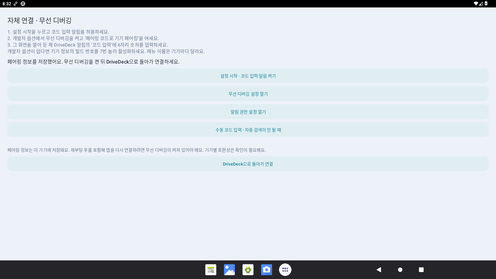

# DriveDeck 사용 설명서

[처음으로](../README.md) · **한국어** · [English](guide.en.md)

이 설명서는 **정식 1.1.4** 기준입니다. **홈 한 번 누르기 → 기본 홈, 길게 누르기 → 설정**입니다. [앱별 배율·스크롤 서랍·조합 편집](preview.ko.md)을 함께 참고하세요. 아래 기존 화면 이미지는 1.1.0 또는 표시된 이전 버전의 촬영본입니다.

## 1. 시작하기

DriveDeck 1.1.4은 Android 13 이상에서 자체 무선 디버깅·루트·Shizuku 연결을 지원합니다. APK를 설치하고 기기에 맞는 연결 방식을 설정한 뒤 내비게이션과 보조 앱을 선택하세요. 같은 앱을 두 구역에 동시에 지정할 수 없습니다.

### 자체 연결 (1.0.1)

별도 권한 앱 없이 Android 무선 디버깅으로 직접 연결합니다. 최초 설치의 기본 선택이며, 업데이트하면 기존 연결 방식을 유지합니다.

1. Wi-Fi에 연결하고 DriveDeck **설정 → 연결 → 연결 방식 → 자체 연결 → 자체 연결 설정**을 엽니다.
2. **설정 시작 · 코드 입력 알림 켜기**를 누르고 알림을 허용합니다.
3. Android 개발자 옵션에서 **무선 디버깅**을 켜고 **페어링 코드로 기기 페어링**을 엽니다. 개발자 옵션이 없다면 기기 정보의 빌드 번호를 7번 눌러 활성화하세요. 제조사에 따라 메뉴 이름이 다릅니다.
4. 코드 화면을 열어 둔 채 알림창을 내려 DriveDeck의 **코드 입력**에 6자리 숫자를 입력합니다. Android 설정에서 나가면 코드가 만료될 수 있습니다.
5. 완료 알림을 확인하고 DriveDeck으로 돌아가 좌우 앱을 선택합니다.

페어링 정보는 이 기기에만 저장되며 설정 백업에 포함하지 않습니다. 앱을 다시 연결할 때는 무선 디버깅이 켜져 있어야 합니다. 재부팅·Wi-Fi 변경·Android의 페어링 삭제 후에는 무선 디버깅을 다시 켜거나 다시 페어링해야 할 수 있습니다. 기기에 무선 디버깅 메뉴가 없으면 루트 또는 Shizuku 연결을 사용하세요.

잘못된 코드라면 Android의 실패 창을 닫고 새 코드 화면을 열어 다시 입력하세요. 자동 검색이 안 되면 코드 화면을 함께 열어 둔 상태에서 수동 코드와 페어링 포트를 입력할 수 있습니다. 페어링 포트는 코드 화면의 주소에서 콜론 뒤 숫자입니다.

실제 폰·차량의 화면 및 입력 호환성은 [검증 범위](validation.md)를 확인하세요. 포함 라이브러리의 고지, 소스와 교체용 자료는 [동일 버전 배포의 relink ZIP](https://github.com/bajohy-totb/drivedeck-releases/releases/tag/v1.1.4)에 제공합니다.

### 물리 키보드 (1.0.1)

USB 또는 Bluetooth 키보드를 연결하고 **보조 앱의 입력란**을 누른 뒤 입력합니다. 내비를 터치해도 키보드 입력 대상은 보조 앱으로 유지하며, 보조 앱 전체화면과 분할 화면에서 사용할 수 있습니다. 설정·앱 목록을 열면 해당 메뉴가 입력을 받고, 닫으면 보조 앱으로 돌아갑니다.

**사이드바와 즐겨찾기 팝업은 키보드 포커스를 받지 않습니다.** 메뉴가 열린 상태에서도 Tab·방향키로 바의 버튼이 선택되지 않습니다. 바의 버튼은 터치·길게 누르기로 조작합니다.

문자와 함께 방향키, 삭제, Home/End, Ctrl·Shift 같은 수정 키도 보조 앱에 전달합니다. 실제 단축키 동작과 한영 전환 방식은 사용하는 앱·Android 키보드 설정·입력기에 따라 다릅니다. 차량과 실제 키보드 기종별 확인 범위는 [검증 기록](validation.md)을 참고하세요.

### Shizuku 연결 (1.0.1)

루팅하지 않은 Android 13 이상 기기는 1.0.1에서 Shizuku 연결을 선택할 수 있습니다.

1. [공식 Shizuku](https://shizuku.rikka.app/download/) 13 이상을 설치하고 무선 디버깅으로 페어링·시작합니다.
2. DriveDeck **설정 → 연결 → 연결 방식 → Shizuku**를 선택합니다.
3. **Shizuku 권한 허용 / 열기**를 누르고 DriveDeck 사용을 허용합니다.
4. 좌우에 서로 다른 앱을 선택합니다. Shizuku가 꺼졌다면 다시 시작하면 자동으로 연결합니다.

기기를 재부팅하면 Shizuku를 다시 시작해야 합니다. 실행·권한이 없을 때 앱이 이유를 표시하며, 자동 재연결 중 승인창을 반복해서 띄우지 않습니다. 연결 방식은 이 기기에 저장되고 레이아웃 백업에는 포함하지 않습니다. 업데이트 APK의 설치 권한과 Shizuku 사용 권한은 별개입니다. 제조사별 화면·입력 호환성은 [검증 범위](validation.md)를 확인하세요.

**설정 → 조작 → 기본 런처로 지정**에서 Android의 홈 앱으로 선택할 수 있습니다. 자동으로 열리는 시점은 차량 기기의 부팅·홈 동작에 따라 달라집니다. 다른 런처로 돌아가려면 Android 홈 앱 설정에서 변경하세요.

## 2. 조작 바와 화면

| 조작 | 동작 |
|---|---|
| 홈 | 한 번 누르면 기본 홈을 실행합니다. 기본 홈이 없으면 현재 앱의 분할 화면으로 돌아갑니다. 길게 누르면 설정을 엽니다. |
| 뒤로 | 앱 목록이나 메뉴를 먼저 닫습니다. 일반 화면에서는 선택한 구역의 앱에 뒤로 가기를 전달합니다. |
| 앱 선택 | 대상 구역을 고르고 분류·검색·스크롤으로 앱을 찾습니다. |
| 내비 앱 이름의 확대 버튼 | 내비를 조작 바 옆의 전체 영역으로 펼칩니다. |
| 분할 화면 | 내비와 보조 앱을 선택한 방향으로 함께 표시합니다. |
| 보조 앱 이름의 확대 버튼 | 보조 앱을 조작 바 옆의 전체 영역으로 펼칩니다. |
| 즐겨찾기 | 빠른 즐겨찾기 팝업을 엽니다. |
| 설정 | 화면·조작·앱·연결·업데이트 메뉴를 엽니다. |

보조 앱 구역에서 문자 입력과 키보드를 사용합니다. 내비 구역은 터치로 지도를 이동·확대할 수 있지만 키보드 입력 대상으로 사용하지 않습니다. 한 앱을 크게 표시하면 숨긴 구역의 화면 출력을 중지합니다. 음악 서비스 등 앱 자체의 백그라운드 작업까지 강제로 멈추지는 않습니다.

가운데 구분선을 누르면 비율 메뉴가 열립니다. 분할 방향을 따라 드래그하면 비율을 미리 보고 손을 놓을 때 적용합니다. 조절 범위는 내비 기준 30~70%입니다.

1.0.1에서는 뒤로가기 연타가 밀려 전달되지 않도록 오래된 입력을 버립니다. 앱 생성 중 배치를 바꾸거나 실행 중 크기가 어긋나면 구역의 현재 크기를 다시 적용합니다. 글씨가 작다면 **앱·키보드 배율** 값을 올리세요. 배율은 글씨와 조작 요소 크기를 바꾸며, 구역의 실제 픽셀 해상도와는 별개입니다.

## 3. 즐겨찾기와 앱 옵션

앱 목록 또는 즐겨찾기 팝업의 아이콘을 길게 누르세요.

| 옵션 | 설명 |
|---|---|
| 즐겨찾기 추가 / 해제 | 바로가기 목록만 변경합니다. 앱은 삭제하지 않습니다. |
| 단독으로 열기 | 앱 자체 화면을 분할 화면 밖에서 실행합니다. 돌아오면 구역을 복원합니다. |
| 내비 / 보조 앱 구역에서 열기 | 해당 구역에 앱을 지정합니다. 다른 구역에서 사용하는 앱은 중복 지정하지 않습니다. |
| 앱 정보 | 해당 앱의 Android 권한·저장 공간 등 설정을 엽니다. |
| 앱 삭제 | Android 삭제 확인창을 엽니다. 기본 앱은 앱 정보에서 관리합니다. |

**설정 → 연결 → 해당 앱의 도움말**에는 앱 변경, 다시 열기, 화면 다시 연결, 단독 실행, 진단 저장·복사, 구역 비우기가 있습니다. 구역 비우기는 선택을 해제하며 설치된 앱을 지우지 않습니다. 일부 영상·보호 콘텐츠 앱은 구역에서 검은 화면을 보이거나 종료될 수 있으므로 단독 실행을 확인하세요.

### 보호 영상 호환 모드

넷플릭스를 분할 화면에서 재생할 때 소리만 나고 영상이 검게 보이는 경우를 위해, 1.1.4부터 넷플릭스에 실제 디스플레이의 분할 창을 사용합니다. 보호 화면·DRM 설정을 해제하거나 영상을 복사하지 않습니다. 앱을 길게 눌러 **보호 영상 호환 모드**를 켜거나 끌 수 있습니다. 이 모드의 배율은 기기 기본값이며 앱별 DPI는 적용되지 않습니다.

분할 크기·전체 화면 전환, 설정·서랍을 열 때 숨기고 닫으면 복원하는 동작을 테스트했습니다. 실제 넷플릭스 계정·차량 DRM 재생은 검증하지 못했으며 제조사 다중 창 구현에 따라 동작이 다를 수 있습니다. 자세한 범위는 [검증 기록](validation.md)을 참고하세요.

## 4. 내 화면 만들기 (1.1.4)

설정 왼쪽의 **화면·조작·앱·연결·업데이트**로 항목을 이동합니다. 작은 화면에서는 오른쪽 내용만 따로 스크롤합니다.

- **화면:** 자동·좌우·위아래 분할, 30~70% 비율, 순서 뒤집기, 조작 바 자동·왼쪽·오른쪽·아래, 앱·키보드 배율 120~640dpi를 설정합니다. 자동은 시작 시 화면 형태에 맞춥니다. 실행 중 기기 회전은 고정하지만 분할 방향과 바 위치는 바꿀 수 있습니다.
- **조작:** 주야간 자동·수동 테마, 앱 이름 바, 선택 구역 테두리, 상태 정보, 서랍·중앙 창·아래 시트 형태, 언어와 기본 런처를 설정합니다. 앱 이름 바는 기본으로 숨깁니다. 읽을 수 있는 온도 센서가 있을 때만 기기 온도를 표시합니다.
- **앱:** 앱 선택, 즐겨찾기 사용·실행 대상, 저장한 조합, 홈 기본 조합, 미디어 제어, 백업·복원을 제공합니다.
- **연결:** 연결 방식·재연결, 각 앱 다시 열기·도움말, 진단 저장·복사를 제공합니다.
- **업데이트:** 현재 버전을 확인하고 업데이트 화면을 엽니다.

별 버튼은 즐겨찾기 최대 3개와 전체 목록을 팝업으로 엽니다. 기본 자동 분류에서는 내비 앱은 내비 구역, 다른 앱은 보조 구역에 엽니다. **선택한 영역에 빠른 실행**을 켜면 현재 선택 구역에 엽니다. 동일 앱의 중복 지정은 막습니다.

**설정 → 앱 → 앱 조합 → 조합 만들기**에서 앱·방향·순서·30~70% 비율·이름을 직접 고르고 저장합니다. 저장은 실행 중인 앱을 바꾸지 않습니다. 최대 8개이며 같은 이름이나 한도 초과는 안내합니다. 조합의 ⋯에서 실행·편집·기본 홈 지정·삭제를 선택합니다. **홈 한 번은 기본 홈, 길게는 설정**입니다. 수정 중 나가면 내용을 버릴지 확인합니다.

앱 목록은 왼쪽에서 전체·즐겨찾기·최근·내비게이션·음악/영상·기타를 선택하고 오른쪽에서 검색합니다. 화면에 맞춰 아이콘 칸 수가 달라지며, 오른쪽 격자를 위아래로 스크롤합니다. 검색과 대상 구역 선택은 고정됩니다. 각 앱의 ⋯ 또는 길게 누르기로 옵션을 엽니다.

## 5. 언어

**설정 → 조작 → 언어 / Language**에서 **기기 설정 따르기 / 한국어 / English**를 선택합니다. Android의 DriveDeck 앱 정보에 있는 언어 설정에서도 변경할 수 있습니다. 한국어 이외의 지원하지 않는 기기 언어에서는 영어를 기본으로 사용합니다.

언어 선택은 Android가 저장합니다. 화면이 다시 열려도 앱 선택·즐겨찾기·배치는 유지됩니다. 지도, 음악, 앱 이름, 알림 원문은 해당 앱이 제공한 내용을 표시합니다. DriveDeck 언어 변경으로 다른 앱의 언어를 바꾸지 않습니다.

## 6. 음악과 내비 안내

**설정 → 앱 → 음악 제어**에서 알림 접근 권한을 연결합니다. 음악 앱이 재생 세션과 명령을 제공할 때 재생/일시정지, 다음 곡, 재생 중인 앱 열기를 사용할 수 있습니다. 지원하지 않는 명령은 비활성화합니다. 음악 앱 화면은 선택한 구역에서 그대로 사용합니다.

내비 앱이 지속 알림으로 안내를 제공하면 내비 화면이 숨겨져 있을 때 안내 띠에 표시할 수 있습니다. 내비 앱마다 알림 형식이 달라 모든 앱을 보장하지 않습니다. 안내가 나오지 않아도 지도 앱 자체의 안내 동작과는 별개입니다.

## 7. 업데이트

**설정 → 업데이트 → 업데이트**에서 새 버전을 확인하고 다운로드·설치합니다. 정식·시험 채널 모두 정식 1.1.4을 제공합니다. RC7 이전 버전은 APK를 한 번 직접 설치해야 합니다. 채널을 바꿔도 구버전으로 자동 내려가지는 않습니다.

다운로드는 화면을 벗어나도 앱 프로세스가 살아 있으면 계속됩니다. 프로세스가 종료된 미완료 다운로드는 다음 실행에서 정리하며 다시 받아야 합니다. 검증 완료 파일은 재실행 후 다시 검증해서 복구합니다. 파일 크기·SHA-256·패키지·버전·Android 버전·서명을 검사합니다. 같은 버전이나 구버전, 다른 서명은 설치 대상으로 허용하지 않습니다.

채널을 바꾸면 이전 채널의 받아 둔 파일을 지웁니다. 새 버전이 없는 채널에는 없다고 표시합니다. 자동 확인은 실행·복귀 시 정상 확인 후 6시간, 실패 후 5분 이상 간격을 두고 실행합니다. 수동 확인은 바로 실행할 수 있습니다. 다운로드와 Android 설치 확인은 직접 진행합니다.

## 8. 백업·진단·복구

**설정 백업**으로 앱 선택, 홈 조합·이름을 붙인 조합, 화면 배치·방향·순서·비율·배율, 즐겨찾기, 최근 앱, 테마를 JSON 파일에 저장합니다. **설정 복원**은 파일을 검사한 뒤 저장된 설정으로 바꾸고 화면을 다시 엽니다. 설치된 앱 자체나 루트·알림·설치 권한, Android가 관리하는 앱 언어는 백업 파일에 포함되지 않습니다.

**기록 파일로 저장**은 진단과 실행 기록을 Download/DriveDeck에 저장합니다. 기본 진단에는 알림 원문·목적지·곡명을 넣지 않습니다. **내비 알림 형식 복사**는 예외적으로 원문을 복사하며 목적지를 포함할 수 있다는 안내를 표시합니다. 진단은 앱에서 사용자가 저장·복사하는 방식이며 이 배포 저장소로 자동 업로드하지 않습니다. 업데이트 확인·다운로드는 GitHub에 접속합니다.

시작 실패가 반복되거나 이전 오류 종료가 감지되면 **안전 모드**에서 다시 시작, 앱 자동 실행 없이 열기, 구역 선택 지우기, 설정 초기화, 다른 런처, 업데이트, 진단 저장을 선택할 수 있습니다. 초기화는 설정을 지우므로 먼저 백업하세요.

## 9. 문제 해결

| 증상 | 확인할 내용 |
|---|---|
| 연결이 끊어짐 / 구역이 비어 있음 | 선택한 연결 방식에 따라 무선 디버깅·페어링, 루트 허용 또는 Shizuku 실행·DriveDeck 권한을 확인합니다. 제조사별 호환성은 [검증 범위](validation.md)를 참고하세요. |
| 앱이 검은 화면이거나 종료됨 | 단독으로 열기를 확인합니다. 앱 자체의 외부 화면·보호 콘텐츠 제한일 수 있습니다. |
| 키보드가 안 나옴 | 보조 앱에서 입력 중인지, Android에 사용할 키보드가 설치·활성화돼 있는지 확인합니다. |
| 음악 제어가 없음 | 알림 접근 권한과 음악 앱의 실제 재생 세션을 확인합니다. |
| 업데이트가 없다고 나옴 | 새 버전 확인을 누르고 현재 버전과 채널을 확인합니다. 같은 버전이나 구버전은 업데이트 대상으로 표시하지 않습니다. |
| 설치가 막힘 | DriveDeck의 앱 설치 허용, 저장 공간, Android 버전, 기존 서명이 같은지 확인합니다. |
| 차량 음소거 때 멈춤 | 아직 해결 확인 전입니다. [검증 범위](validation.md)를 확인하세요. |

모든 앱·차량·제조사 조합의 정상 동작을 검증한 상태는 아닙니다. [화면 모음](screenshots.md)과 [배포 기록](https://github.com/bajohy-totb/drivedeck-releases/releases)을 함께 참고하세요.

### 1.0.1 연결·업데이트 확인 개선

연결 응답을 기다리는 동안 화면 처리를 계속합니다. 수동 재시도는 이전 예약을 취소하며 자동 재시도 간격은 최대 30초입니다. 업데이트 자동 확인은 정상 응답 후 6시간, 실패 후 5분이 지난 다음 앱 실행·복귀 때 가능합니다. 수동 확인은 기다릴 필요가 없습니다.
