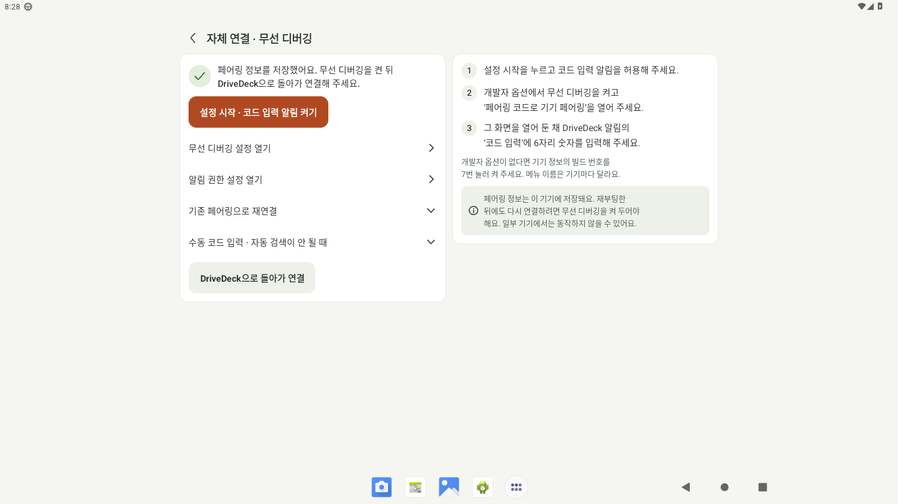
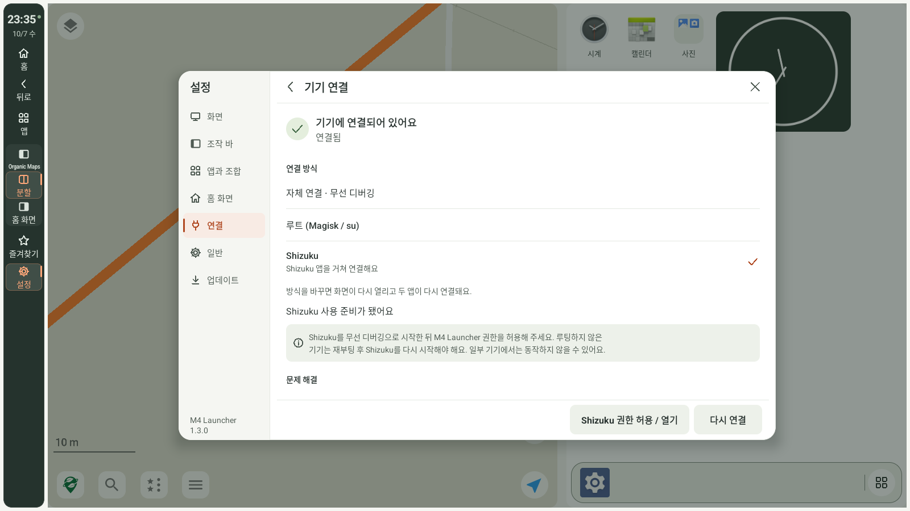

# DriveDeck 사용 설명서

[처음으로](../README.md) · **한국어** · [English](guide.en.md)

이 설명서는 **정식 1.2.1** 기준입니다. **홈 버튼은 홈 화면을 열고, 길게 누르면 설정을 엽니다.** 기본 홈을 지정해 둔 경우에는 한 번 누르면 기본 홈으로 갑니다. [앱 크기·앱 목록·조합 사용법](preview.ko.md)을 함께 참고하세요.

## 1. 시작하기

DriveDeck 1.2.1은 Android 13 이상에서 자체 무선 디버깅·루트·Shizuku 연결을 지원합니다. APK를 설치하고 기기에 맞는 연결 방식을 설정한 뒤 내비 앱과 보조 앱을 선택하세요. 빈 구역의 **앱 선택**이나 조작 바의 **앱**에서 고릅니다. 같은 앱을 두 구역에 동시에 지정할 수 없습니다.

### 자체 연결

별도 권한 앱 없이 Android 무선 디버깅으로 직접 연결합니다. 최초 설치의 기본 선택이며, 업데이트하면 기존 연결 방식을 유지합니다.

1. Wi-Fi에 연결하고 DriveDeck **설정 → 연결 → 연결 방식**에서 **자체 연결 · 무선 디버깅**을 고른 뒤 **자체 연결 설정**을 엽니다.
2. **설정 시작 · 코드 입력 알림 켜기**를 누르고 알림을 허용합니다.
3. Android 개발자 옵션에서 **무선 디버깅**을 켜고 **페어링 코드로 기기 페어링**을 엽니다. 개발자 옵션이 없다면 기기 정보의 빌드 번호를 7번 눌러 활성화하세요. 제조사에 따라 메뉴 이름이 다릅니다.
4. 코드 화면을 열어 둔 채 알림창을 내려 DriveDeck 알림의 **코드 입력**에 6자리 숫자를 입력합니다. Android 설정에서 나가면 코드가 만료될 수 있습니다.
5. 완료 알림을 확인하고 DriveDeck으로 돌아가 두 구역의 앱을 선택합니다.

페어링 정보는 이 기기에만 저장되며 설정 백업에 포함하지 않습니다. 앱을 다시 연결할 때는 무선 디버깅이 켜져 있어야 합니다. 재부팅·Wi-Fi 변경·Android의 페어링 삭제 후에는 무선 디버깅을 다시 켜거나 다시 페어링해야 할 수 있습니다. 기기에 무선 디버깅 메뉴가 없으면 루트 또는 Shizuku 연결을 사용하세요.

잘못된 코드라면 Android의 실패 창을 닫고 새 코드 화면을 열어 다시 입력하세요. 자동 검색이 안 되면 코드 화면을 함께 열어 둔 상태에서 **수동 코드 입력 · 자동 검색이 안 될 때**에 코드와 페어링 포트를 입력할 수 있습니다. 페어링 포트는 코드 화면의 주소에서 콜론 뒤 숫자입니다.

실제 폰·차량의 화면 및 입력 호환성은 [검증 범위](validation.md)를 확인하세요. 포함 라이브러리의 고지, 소스와 교체용 자료는 [동일 버전 배포의 relink ZIP](https://github.com/bajohy-totb/drivedeck-releases/releases/tag/v1.2.1)에 제공합니다.

### 루트 연결

루팅한 기기는 **설정 → 연결 → 연결 방식**에서 **루트 (Magisk / su)**를 선택합니다. 루트 권한 요청을 거절했거나 답하지 않았다면 **다시 연결**을 눌러 다시 요청합니다.

### Shizuku 연결

루팅하지 않은 Android 13 이상 기기는 Shizuku 연결을 선택할 수 있습니다.

1. [공식 Shizuku](https://shizuku.rikka.app/download/) 13 이상을 설치하고 무선 디버깅으로 페어링·시작합니다.
2. DriveDeck **설정 → 연결 → 연결 방식 → Shizuku**를 선택합니다.
3. **Shizuku 권한 허용 / 열기**를 누르고 DriveDeck 사용을 허용합니다.
4. 두 구역에 서로 다른 앱을 선택합니다. Shizuku가 꺼졌다면 다시 시작하면 자동으로 연결합니다.

기기를 재부팅하면 Shizuku를 다시 시작해야 합니다. 실행·권한이 없을 때 앱이 이유를 표시하며, 자동 재연결 중 승인창을 반복해서 띄우지 않습니다. 연결 방식은 이 기기에 저장되고 설정 백업에는 포함하지 않습니다. 업데이트 APK의 설치 권한과 Shizuku 사용 권한은 별개입니다. 제조사별 화면·입력 호환성은 [검증 범위](validation.md)를 확인하세요.

연결에 설정이 더 필요한 상태라면 연결 화면의 주 버튼이 **다시 연결** 대신 그 설정을 엽니다.

**설정 → 일반 → 기본 런처로 지정**에서 Android의 홈 앱으로 선택할 수 있습니다. 자동으로 열리는 시점은 차량 기기의 부팅·홈 동작에 따라 달라집니다. 다른 런처로 돌아가려면 Android 홈 앱 설정에서 변경하세요.

## 2. 조작 바와 화면

조작 바의 모든 버튼에는 이름이 붙어 있습니다.

| 버튼 | 동작 |
|---|---|
| 홈 | 한 번 누르면 보조 구역에 [홈 화면](#3-홈-화면)을 엽니다. 홈 버튼을 기본 홈으로 정해 두었다면 기본 홈을 실행합니다. 길게 누르면 설정을 엽니다. |
| 뒤로 | 대화상자·메뉴·앱 목록을 먼저 닫습니다. 일반 화면에서는 선택한 구역의 앱에 뒤로 가기를 전달합니다. |
| 앱 | 앱 목록을 엽니다. 대상 구역을 고르고 분류·검색·스크롤로 앱을 찾습니다. |
| 내비 앱 이름 | 내비 앱을 조작 바 옆의 전체 영역으로 펼칩니다. |
| 분할 | 내비 앱과 보조 앱을 선택한 방향으로 함께 표시합니다. |
| 보조 앱 이름 | 보조 앱을 조작 바 옆의 전체 영역으로 펼칩니다. |
| 즐겨찾기 | 빠른 즐겨찾기 팝업을 엽니다. |
| 설정 | 화면·조작 바·앱과 조합·연결·일반·업데이트 메뉴를 엽니다. 새 버전이 있으면 버튼에 점이 표시됩니다. |

높이가 넉넉한 화면에서는 조작 바에 시각·날짜·칩 온도·연결 상태도 보입니다. 칩 온도는 CPU 센서들의 중간값입니다. 85°C 이상이면 주황색으로 바뀌고 82°C 아래로 내려가면 돌아갑니다. 시계 묶음을 길게 누르면 중간값과 가장 높은 센서 값, 센서 이름이 나옵니다. 읽을 수 있는 온도 센서가 없으면 온도를 표시하지 않습니다. 버튼이 다 들어가지 않는 화면에서는 조작 바를 스크롤합니다.

한 앱을 크게 표시하면 숨긴 구역의 화면 출력을 중지합니다. 음악 서비스 등 앱 자체의 백그라운드 작업까지 강제로 멈추지는 않습니다.

### 화면 비율과 위치 바꾸기

가운데 구분선을 누르면 **화면 비율** 패널이 열립니다. 30 : 70부터 70 : 30까지 다섯 가지 비율 중에서 고릅니다. 숫자는 화면에 보이는 순서(왼쪽·오른쪽 또는 위·아래)대로 읽습니다. 패널의 **위치 바꾸기**는 두 앱을 다시 실행하지 않고 자리만 바꿉니다.

구분선을 끌면 5% 단위로 비율을 미리 보고 손을 놓을 때 적용합니다. 진동이 있는 기기에서는 단위마다 짧게 진동합니다. 조절 범위는 30~70%입니다.

뒤로가기 연타가 밀려 전달되지 않도록 오래된 입력을 버립니다. 앱 생성 중 배치를 바꾸거나 실행 중 크기가 어긋나면 구역의 현재 크기를 다시 적용합니다. 글씨가 작다면 **설정 → 화면 → 공통 앱 크기 (DPI)** 값을 올리세요. 앱 크기는 글씨와 조작 요소 크기를 바꾸며, 구역의 실제 픽셀 해상도와는 별개입니다.

구역이 커진 뒤(분할에서 크게 보기로 바꿀 때 등) 내비 앱이 예전 크기로 남아 나머지가 검게 보이면, 몇 초 뒤(약 3~5초) 그 구역의 화면 출력만 잠깐 껐다 켜서 새 크기로 다시 그리게 합니다. 앱을 종료하지 않으므로 길 안내 경로는 그대로입니다. 내비 구역에만 적용하고 크기가 한 번 바뀔 때 최대 두 번까지 시도합니다. 화면 방향을 고정하는 앱이 정사각형에 가까운 화면에서 가운데에 좁게 보일 때도 같은 방법을 씁니다. 실제 카카오내비로는 아직 확인하지 못했습니다.

## 3. 홈 화면

*실제 Android 13 에뮬레이터 화면입니다. 지도와 위젯은 따로 설치한 앱이 제공하며 DriveDeck에 포함되지 않습니다. 차량·주행 시험 사진은 아닙니다.*

홈 버튼을 누르면 내비 앱은 그대로 두고 보조 구역에 **홈 화면**을 엽니다. 한 앱만 크게 보고 있었다면 분할 화면으로 돌아옵니다. 홈 화면도 구역 안의 앱처럼 비율 조절, 위치 바꾸기, 크게 보기를 쓸 수 있습니다. 처음에는 즐겨찾기와 최근에 쓴 앱이 올라가 있습니다.

| 조작 | 동작 |
|---|---|
| 앱 아이콘 누르기 | 그 구역에 앱을 엽니다. 홈을 다시 누르면 홈 화면으로 돌아옵니다. 열려 있던 앱은 휴대전화처럼 홈 화면 뒤에 남습니다. |
| + (추가) | **위젯 추가** 또는 **앱 추가**를 고릅니다. 앱 추가에서는 목록을 닫을 때까지 누르는 앱마다 홈에 올라갑니다. |
| 길게 눌러 끌기 | 자리를 옮깁니다. 위쪽의 **여기에 놓으면 홈에서 빼요** 막대에 놓으면 홈에서 뺍니다. |
| 길게 누른 뒤 그대로 떼기 | 옵션을 엽니다. 앞으로 옮기기·뒤로 옮기기·홈에서 빼기가 있고, 앱은 다른 구역에서 열기와 앱 옵션, 위젯은 **크기 조절**이 더 있습니다. |
| 크기 조절 | 가로와 세로를 칸 단위로 줄이거나 늘리고 **완료**를 누릅니다. 가로는 그 구역의 칸 수까지, 세로는 6칸까지입니다. |
| 모든 앱 | 앱 목록을 엽니다. 고른 앱은 그 구역에 열립니다. 목록의 앱을 길게 누르면 홈에 추가하거나 뺄 수 있습니다. |

위젯은 기기 연결을 통해 Android의 권한 질문 없이 올립니다. 그렇게 허용하지 못한 경우에는 Android가 허용 여부를 묻습니다. 먼저 설정이 필요한 위젯은 그 위젯의 설정 화면을 엽니다. 위젯을 누르면 그 위젯의 앱이 같은 구역에 열립니다. 배경 없이 흰 글자만 그리는 위젯(배경 화면 위에 놓도록 만든 시계·날씨 위젯)은 밝은 화면에서도 보이도록 어두운 카드 위에 올립니다. 위젯의 종류와 내용, 지원하는 크기는 각 앱이 정합니다.

화면 밀도가 높은 기기에서도 홈 화면은 런처와 같은 크기로 그립니다. 위젯 내용은 그 구역의 앱 크기를 따릅니다. 홈에는 최대 80개까지 올릴 수 있습니다. **홈에서 빼기는 앱을 삭제하지 않습니다.** 홈 화면에서 **뒤로**는 홈 화면 위에 열린 목록이나 대화상자만 닫습니다.

**기본 홈을 쓰는 경우:** 조합을 기본 홈으로 지정해 둔 사용자는 홈 버튼이 이전처럼 그 조합으로 돌아갑니다. **설정 → 앱과 조합 → 홈 버튼**에서 **홈 화면**과 **기본 홈** 중 무엇을 열지 고릅니다. 기본 홈을 처음 지정하면 홈 버튼이 기본 홈으로 바뀌고, 기본 홈을 지우면 다시 홈 화면을 엽니다.

실제 엠스틱4와 갤럭시 Z 폴드8로는 아직 확인하지 못했습니다.

## 4. 키보드 입력

### 화면 키보드

내비 앱이든 보조 앱이든 입력란을 누르면 그 앱에 키보드가 바로 열립니다. 지도의 검색창에도 따로 켜는 것 없이 입력합니다.

**마지막으로 누른 구역**이 입력을 받습니다. 다른 구역을 끌거나 두 손가락으로 확대·축소해도(지도 이동) 입력 중인 앱의 키보드는 그대로입니다. 길게 누르기도 입력 대상을 바꾸지 않습니다. 설정·앱 목록 같은 런처 메뉴를 열면 그 메뉴가 입력을 받고, 닫으면 마지막으로 누른 구역으로 돌아갑니다.

### 물리 키보드

USB 또는 Bluetooth 키보드를 연결하고 **입력할 앱의 입력란**을 누른 뒤 입력합니다. 화면 키보드와 같이 마지막으로 누른 구역의 앱이 글자를 받으며, 한 앱을 크게 본 화면과 분할 화면에서 모두 사용할 수 있습니다.

**조작 바와 즐겨찾기 팝업은 키보드 포커스를 받지 않습니다.** 메뉴가 열린 상태에서도 Tab·방향키로 바의 버튼이 선택되지 않습니다. 바의 버튼은 터치·길게 누르기로 조작합니다.

문자와 함께 방향키, 삭제, Home/End, Ctrl·Shift 같은 수정 키도 입력 대상 앱에 전달합니다. 실제 단축키 동작과 한영 전환 방식은 사용하는 앱·Android 키보드 설정·입력기에 따라 다릅니다. 차량과 실제 키보드 기종별 확인 범위는 [검증 기록](validation.md)을 참고하세요.

## 5. 즐겨찾기와 앱 옵션

앱 목록 또는 즐겨찾기 팝업의 아이콘을 길게 누르세요. 앱 이름 바를 켰다면 그 바의 ⋯ 버튼으로도 열립니다.

| 옵션 | 설명 |
|---|---|
| 즐겨찾기 추가 / 해제 | 바로가기 목록만 변경합니다. 앱은 삭제하지 않습니다. |
| 내비 구역 / 보조 구역에서 열기 | 해당 구역에 앱을 지정합니다. 다른 구역에서 사용하는 앱은 중복 지정하지 않습니다. |
| 단독으로 열기 | 앱 자체 화면을 분할 화면 밖에서 실행합니다. 돌아오면 구역을 복원합니다. |
| 앱 크기 (DPI) | 이 앱만의 글씨·버튼 크기를 정합니다. [사용법](preview.ko.md) |
| 보호 영상 호환 모드 | 아래 설명을 참고하세요. |
| 앱 정보 | 해당 앱의 Android 권한·저장 공간 등 설정을 엽니다. |
| 앱 삭제 | Android 삭제 확인창을 엽니다. 기본 앱은 앱 정보에서 관리합니다. |

**설정 → 연결 → 구역별 앱 상태**에서 앱을 누르면 **구역 관리**가 열립니다. 앱 변경, 다시 열기, 화면 다시 연결, 단독으로 열기, 기록 파일로 저장, 진단 정보 복사, 이 구역 비우기가 있습니다. 이 구역 비우기는 확인을 받은 뒤 선택을 해제하며 설치된 앱을 지우지 않습니다. 일부 영상·보호 콘텐츠 앱은 구역에서 검은 화면을 보이거나 종료될 수 있으므로 단독 실행을 확인하세요.

### 보호 영상 호환 모드

넷플릭스를 분할 화면에서 재생할 때 소리만 나고 영상이 검게 보이는 경우를 위해, 넷플릭스에는 실제 디스플레이의 제한된 창을 사용합니다. 기존 창 제어 함수가 없는 기기에서는 Android 자유 창을 사용합니다. 자유 창 지원이 필요하며 시스템 제목 표시줄이 보일 수 있습니다. 보호 화면·DRM 설정을 해제하거나 영상을 복사하지 않습니다. 앱을 길게 눌러 **보호 영상 호환 모드**를 켜거나 끌 수 있습니다. 이 모드는 기기 기본 배율을 쓰며 앱 크기 (DPI)는 적용되지 않습니다.

Android 14 이상에서는 분할과 크게 보기를 바꿀 때 영상 창과 제목 표시줄이 함께 움직이도록 시스템 전환 경로로 옮깁니다. Android 13 기기에서 처음 띄운 영상 창이 보이지 않던 문제와, 영상 창을 다시 띄운 직후 뒤로 가기가 가끔 듣지 않던 문제를 고쳤습니다. 영상 창 둘레는 구역 배경으로 가립니다.

실제 넷플릭스 계정·차량 DRM 재생은 검증하지 못했으며 제조사 다중 창 구현에 따라 동작이 다를 수 있습니다. 실제 갤럭시 Z 폴드8(Android 17)로도 아직 확인하지 못했습니다. 자세한 범위는 [검증 기록](validation.md)을 참고하세요.

## 6. 내 화면 만들기

설정 왼쪽의 **화면·조작 바·앱과 조합·연결·일반·업데이트**로 항목을 이동합니다. 작은 화면에서는 오른쪽 내용만 따로 스크롤합니다.

- **화면:** 배치 미리보기, 분할 방향(자동·좌우·상하), 화면 비율(30~70%), 앱 위치 바꾸기, 앱 크기(공통 앱 크기 120~640dpi와 구역별 앱 크기)를 설정합니다. 자동은 시작 시 화면 형태에 맞춥니다. 실행 중 기기 회전은 고정하지만 분할 방향과 바 위치는 바꿀 수 있습니다.
- **조작 바:** 조작 바 위치(자동·왼쪽·오른쪽·아래), 조작 바 상태 표시, 즐겨찾기 버튼, 선택한 구역에서 바로 열기, 앱 이름 바, 선택한 앱 표시를 설정합니다. 앱 이름 바는 기본으로 숨깁니다.
- **앱과 조합:** 지금 사용하는 앱, 홈 버튼(홈 화면·기본 홈), 앱 조합, 기본 홈 저장·지우기, 즐겨찾기, 음악 제어, 설정 백업·복원을 제공합니다.
- **연결:** 연결 상태와 연결 방식, 다시 연결, 구역별 앱 상태와 다시 열기, 기록 파일 저장·진단 정보 복사를 제공합니다.
- **일반:** 화면 테마(자동·주간·야간), 메뉴 위치(오른쪽·가운데·아래), 언어, 기본 런처로 지정을 제공합니다.
- **업데이트:** 현재 버전을 확인하고 업데이트 화면을 엽니다.

화면 테마의 자동은 기기의 야간 모드를 따르고, 저녁 7시부터 아침 7시까지는 야간 테마를 씁니다. 낮·밤이 바뀔 때 열려 있는 화면을 다시 만들지 않고 색만 바꿉니다. 설정 전체 초기화, 백업 복원, 기본 홈 지우기, 구역 비우기, 내비 알림 원문 복사는 실행 전에 확인을 받습니다. 알림은 터치와 키 입력을 가로채지 않습니다.

별 버튼은 즐겨찾기 최대 3개와 **전체 보기**를 팝업으로 엽니다. 기본으로 내비 앱은 내비 구역, 다른 앱은 보조 구역에 엽니다. **선택한 구역에서 바로 열기**를 켜면 현재 선택한 구역에 엽니다. 동일 앱의 중복 지정은 막습니다.

**설정 → 앱과 조합 → 앱 조합 → 조합 만들기**에서 앱·배치·순서·30~70% 비율·이름을 직접 고르고 저장합니다. 저장은 실행 중인 앱을 바꾸지 않습니다. 최대 8개이며 같은 이름이나 한도 초과는 안내합니다. 조합의 ⋯에서 실행·조합 편집·기본 홈으로 지정·조합 삭제를 선택합니다. 수정 중 나가면 내용을 버릴지 확인합니다.

앱 목록은 왼쪽에서 전체·즐겨찾기·최근·내비·음악 · 영상·기타 앱을 선택하고, 위쪽 한 줄에서 검색과 대상 구역을 고릅니다. 화면에 맞춰 아이콘 칸 수가 달라지며 격자를 위아래로 스크롤합니다. 앱을 길게 누르면 옵션이 열립니다.

## 7. 언어

**설정 → 일반 → 언어 / Language**에서 **기기 설정 따르기 / 한국어 / English**를 선택합니다. Android의 DriveDeck 앱 정보에 있는 언어 설정에서도 변경할 수 있습니다. 한국어 이외의 지원하지 않는 기기 언어에서는 영어를 기본으로 사용합니다.

언어 선택은 Android가 저장합니다. 화면이 다시 열려도 앱 선택·즐겨찾기·배치는 유지됩니다. 지도, 음악, 앱 이름, 알림 원문은 해당 앱이 제공한 내용을 표시합니다. DriveDeck 언어 변경으로 다른 앱의 언어를 바꾸지 않습니다.

## 8. 음악과 내비 안내

**설정 → 앱과 조합 → 음악 제어**에서 **알림 접근 허용**으로 권한을 연결합니다. 음악 앱이 재생 세션과 명령을 제공할 때 재생/일시정지, 다음 곡, 재생 중인 앱 열기를 사용할 수 있습니다. 지원하지 않는 명령은 비활성화합니다. 음악 앱 화면은 선택한 구역에서 그대로 사용합니다.

내비 앱이 지속 알림으로 안내를 제공하면 내비 화면이 숨겨져 있을 때 안내 띠에 표시할 수 있습니다. 내비 앱마다 알림 형식이 달라 모든 앱을 보장하지 않습니다. 안내가 나오지 않아도 지도 앱 자체의 안내 동작과는 별개입니다.

## 9. 업데이트

**설정 → 업데이트 → 업데이트**에서 **새 버전 확인 → 업데이트 다운로드 → 업데이트 설치** 순서로 진행합니다. 정식 채널은 1.2.1, 시험 채널은 1.3.0-rc10를 제공합니다(이 버전부터 앱 이름이 M4 Launcher입니다). 이 설명서의 홈 화면 설명은 1.2.1 기준이며, 1.3.0-rc10의 홈 화면(폴더, 배경, 쓸어 올리는 앱 목록)은 배포 기록의 변경 내용을 참고하세요. 시험 채널은 업데이트 화면의 **시험 버전 받기**로 켭니다. 1.0.0-rc7보다 오래된 버전은 APK를 한 번 직접 설치해야 합니다. 채널을 바꿔도 구버전으로 자동 내려가지는 않습니다.

다운로드는 진행 막대와 퍼센트로 표시하며, 화면을 벗어나도 앱 프로세스가 살아 있으면 계속됩니다. 프로세스가 종료된 미완료 다운로드는 다음 실행에서 정리하며 다시 받아야 합니다. 검증 완료 파일은 재실행 후 다시 검증해서 복구합니다. 파일 크기·SHA-256·패키지·버전·Android 버전·서명을 검사합니다. 같은 버전이나 구버전, 다른 서명은 설치 대상으로 허용하지 않습니다.

채널을 바꾸면 이전 채널의 받아 둔 파일을 지웁니다. 받아 둔 설치 파일이 있을 때는 먼저 확인을 받습니다. 새 버전이 없는 채널에는 없다고 표시합니다. 자동 확인은 실행·복귀 시 정상 확인 후 6시간, 실패 후 5분 이상 간격을 두고 실행합니다. 수동 확인은 바로 실행할 수 있습니다. 다운로드와 Android 설치 확인은 직접 진행합니다.

## 10. 백업·진단·복구

**설정 → 앱과 조합 → 설정 백업**으로 앱 선택, 기본 홈과 이름을 붙인 조합, 홈 버튼 선택, 화면 배치·방향·순서·비율, 공통·앱별 앱 크기, 즐겨찾기, 최근 앱, 테마를 JSON 파일에 저장합니다. **설정 복원**은 파일을 검사하고 확인을 받은 뒤 저장된 설정으로 바꾸고 화면을 다시 엽니다. 설치된 앱 자체, 홈 화면에 올린 앱과 위젯, 연결 방식, 루트·알림·설치 권한, Android가 관리하는 앱 언어는 백업 파일에 포함되지 않습니다.

**설정 → 연결 → 기록 파일로 저장**은 진단과 실행 기록을 Download/DriveDeck에 저장합니다. 기본 진단에는 알림 원문·목적지·곡명을 넣지 않습니다. **내비 알림 형식 복사**는 예외적으로 원문을 복사하며 목적지를 포함할 수 있다는 확인을 먼저 받습니다. 진단은 앱에서 사용자가 저장·복사하는 방식이며 이 배포 저장소로 자동 업로드하지 않습니다. 업데이트 확인·다운로드는 GitHub에 접속합니다.

시작 실패가 반복되거나 이전 오류 종료가 감지되면 **안전 모드**에서 그대로 다시 시작, 앱 자동 실행 없이 열기, 구역 앱 선택 지우고 시작, 설정 전체 초기화, 다른 런처 선택, 업데이트, 기록 파일로 저장을 선택할 수 있습니다. 초기화는 앱 선택·조합·즐겨찾기·화면 설정을 지우므로 먼저 백업하세요. 설치된 앱과 연결 방식, 언어는 그대로입니다.

## 11. 문제 해결

| 증상 | 확인할 내용 |
|---|---|
| 연결이 끊어짐 / 구역이 비어 있음 | 선택한 연결 방식에 따라 무선 디버깅·페어링, 루트 허용 또는 Shizuku 실행·DriveDeck 권한을 확인합니다. 제조사별 호환성은 [검증 범위](validation.md)를 참고하세요. |
| 앱이 검은 화면이거나 종료됨 | 단독으로 열기를 확인합니다. 앱 자체의 외부 화면·보호 콘텐츠 제한일 수 있습니다. |
| 구역을 키운 뒤 지도가 예전 크기로 남음 | 몇 초 기다리면 내비 구역을 자동으로 다시 그립니다. 구역 전체가 검거나 그대로라면 다른 화면에 갔다 오세요. |
| ‘이 구역의 화면 연결이 불안정해요’ 알림 | 같은 구역에서 10초 안에 세 번 실패하면 나옵니다. 구역 관리의 다시 열기나 화면 다시 연결을 눌러 보세요. |
| 키보드가 안 나옴 | 입력할 앱의 입력란을 한 번 더 누릅니다. Android에 사용할 키보드가 설치·활성화돼 있는지 확인합니다. |
| 키보드는 떠 있는데 글자가 안 들어감 | 다른 구역에 키보드가 떠 있는 채로 입력란을 눌렀을 때 가끔 생깁니다. Android가 키보드를 옮기는 순간 화면 크기를 잘못 알려 앱이 입력란의 선택을 푸는 경우입니다. 입력란을 한 번 더 누르면 됩니다. |
| 위젯이 올라가지 않음 | 기기 연결 상태를 확인하고, Android가 허용 여부를 물으면 허용합니다. |
| 음악 제어가 없음 | 알림 접근 권한과 음악 앱의 실제 재생 세션을 확인합니다. |
| 업데이트가 없다고 나옴 | 새 버전 확인을 누르고 현재 버전과 채널을 확인합니다. 같은 버전이나 구버전은 업데이트 대상으로 표시하지 않습니다. |
| 설치가 막힘 | DriveDeck의 앱 설치 허용, 저장 공간, Android 버전, 기존 서명이 같은지 확인합니다. |
| 차량 음소거 때 멈춤 | 아직 해결 확인 전입니다. [검증 범위](validation.md)를 확인하세요. |

모든 앱·차량·제조사 조합의 정상 동작을 검증한 상태는 아닙니다. [화면 모음](screenshots.md)과 [배포 기록](https://github.com/bajohy-totb/drivedeck-releases/releases)을 함께 참고하세요.

### 연결·업데이트 확인

연결 응답을 기다리는 동안 화면 처리를 계속합니다. 수동 재시도는 이전 예약을 취소하며 자동 재시도 간격은 최대 30초입니다. 업데이트 자동 확인은 정상 응답 후 6시간, 실패 후 5분이 지난 다음 앱 실행·복귀 때 가능합니다. 수동 확인은 기다릴 필요가 없습니다.

### 보호 영상 오류 코드

차량에서 창이 열리지 않으면 먼저 **앱 다시 열기**를 누르세요. 반복되면 화면 아래의 짧은 코드만 알려 주세요. 상세 원인은 앱 진단 기록에도 남습니다.

| 코드 | 실패 단계 |
|---|---|
| PW01 | 앱 실행 자격, 화면 영역 또는 시스템 바를 피한 안전 영역 확인 |
| PW02 | Android에 앱 실행 요청 또는 다른 창과의 충돌 |
| PW03 | 실제 디스플레이의 분할 창 생성 확인 또는 기기의 자유 창 미지원 |
| PW04 | 창 크기·표면·표시 상태 적용 |
| PW05 | 실제 창의 위치와 크기 검증 |
| PW06 | 실행 중 예상한 창 모드(분할·자유 창) 이탈 |
| PW07 | 자유 창의 터치 영역이 선택한 영역 밖까지 퍼져 런처 조작을 막으므로 실행 중단 |
| PW00 | 그 외 연결 또는 창 처리 오류 |

코드는 실패 단계를 뜻하며 원인을 확정하는 진단은 아닙니다. 1.2.1에서도 실제 차량·넷플릭스 재생은 검증되지 않았습니다.
