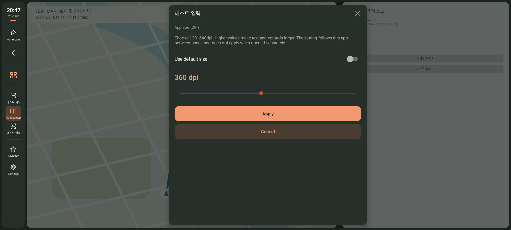
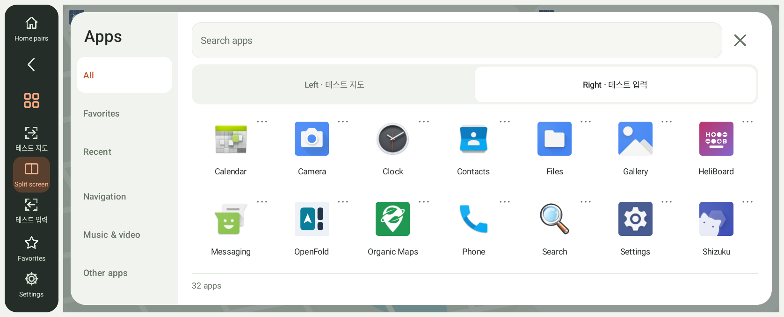
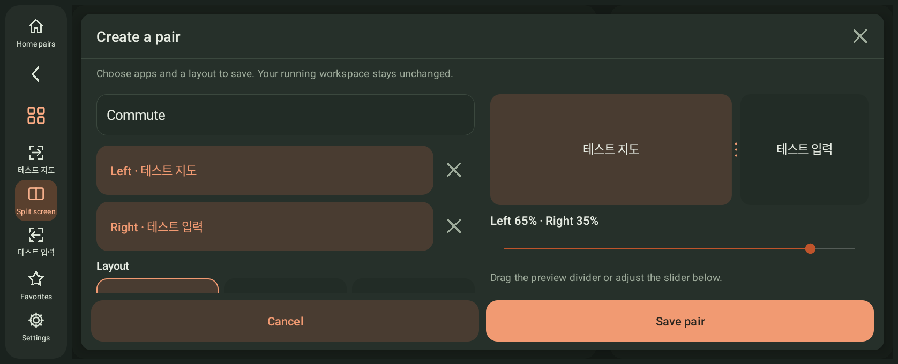

# DriveDeck 1.1.6 scaling, library and pairs

[Overview](../README.en.md) · [한국어](preview.ko.md) · [Basic guide](guide.en.md)

**Stable 1.1.6** includes per-app scaling, a scrolling library and editable home pairs. **Tap Home for default home; hold Home for Settings.** Both update channels offer the same 1.1.6 release. Install over your existing app to retain settings. Screenshots below were captured in 1.1.1-rc2.

## Update from the app

Open **Settings → Updates → Updates**, then check, download and install. Confirm installation in Android. You do not need to find and transfer each APK manually. Installation permission is separate from the built-in, root or Shizuku connection permission.

Each update check now uses a fresh request URL to reduce stale CDN metadata immediately after publication. Only newer version codes are offered; changing channels does not downgrade the app. Cancelling installation preparation also suppresses an installer callback that has already been queued.

## Scale each app separately

*Android 13 emulator capture of 1.1.1-rc2. The displayed test app is a separate fixture for density and input checks.*

Open an app's **⋯ or long-press menu → App size (DPI)**. The selected apps are also available under **Settings → Apps**. Shared and per-app density ranges are **120–640dpi**. Higher density makes text and controls larger, with less content visible at once.

Overrides follow the app package across replacements and saved pairs. Choose **Use default size** to remove an override. Overrides do not apply when opening an app separately. Apps impose their own minimum widths and layout rules; reduce density if content becomes cramped. This setting does not lower the pane's pixel resolution.

## Scrolling app library

*Actual emulator capture. The list includes separate apps used for functional testing.*

Choose All, Favorites, Recent, Navigation, Media or Other on the left, then scroll the app grid vertically. Search and pane selection stay in place. Refreshing installed apps preserves your query and target pane. Initial scans show loading status, and failed scans offer a retry.

## Build a home pair

*Actual Android 13 emulator capture of 1.1.1-rc2. The two apps with Korean names are map and text-input test fixtures. This is not a vehicle photograph.*

1. Hold Home to open Settings, then choose **Apps → App combinations → Create a pair**.
2. Choose a name and apps. One pane may be empty; the same app cannot occupy both.
3. Choose automatic, side-by-side or stacked arrangement and pane order. Drag the preview divider or use the slider to set a ratio between 30% and 70%.
4. Enable **Set as default home** if desired.
5. **Save** adds the pair without launching it. Tap the saved row to apply its apps and layout.

App selection, preview and cancellation leave the running workspace unchanged. Short, wide displays use two editing columns. Save and Cancel stay in a fixed footer; the on-screen keyboard leaves the name and Save button accessible. Leaving a modified draft through the sidebar or Close asks before discarding it. Activity recreation and language changes restore the draft and app picker.

Use a pair's **⋯** menu to run, edit, assign or clear default home, or delete it. Up to eight pairs are supported. Duplicate names and capacity limits show an error instead of silently overwriting or deleting another pair. Pairs containing removed apps remain editable.

**Tap Home** to run default home; **hold Home** to open Settings. Without a default it returns to the selected apps in split mode. A quick **save current configuration as default home** action remains available. Running a pair retains each app's density override.

## Recover the built-in connection after a restart

Open **Reconnect with saved pairing** in Built-in connection setup, then **Check connection again**. If wireless debugging is already on but connection fails, switch it off and on in Android settings and return.

If discovery still fails, enter the number after the colon in Android Wireless debugging’s **IP address & Port**. **This is different from the port on the pairing-code screen.** The check uses saved pairing to connect only to this device, and saves the port only after success. Invalid ports, failed checks and cancellation do not erase pairing. Pair again if DriveDeck itself was removed from Android’s paired-device list.

## Backup and compatibility

Backups include named pairs, the default home's apps, axis, order and ratio, and per-app densities. Older backups remain supported. Invalid formats and ranges reject the whole import before changing settings. Installed apps, connection permissions and Android language settings are not included.

A physical-keyboard ordering issue remains when Android or another app forces input back to the default display immediately before rapid typing: the first forwarded letter may arrive out of order. This forced-focus test failed with both built-in ADB and Shizuku and is excluded from the pass count. Tap the intended app’s text field again before continuing.

Stable publication does not establish exhaustive validation of vehicle controls, Bluetooth hardware, ignition power or manufacturer firmware. A synthetic key could block input before an app window was ready; that path was changed and repeated sleep, Settings return and forced recovery were retested. Validation also reproduced an emulator LatinIME service ANR, an IME crash while attaching to a removed display, invisible keyboard-window touch interception and renderer delays during startup and connection recovery. The preceding rc2 APK also reproduced a LatinIME ANR and roughly 6.1–6.4-second startup delays. Those failures remain recorded; later passing rechecks do not establish root-cause resolution. Orientation stays locked while running. See [validation scope](validation.md) for successful and failed coverage.
