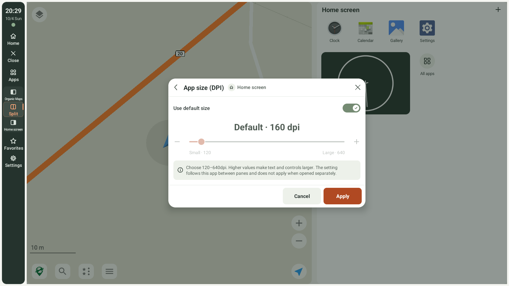
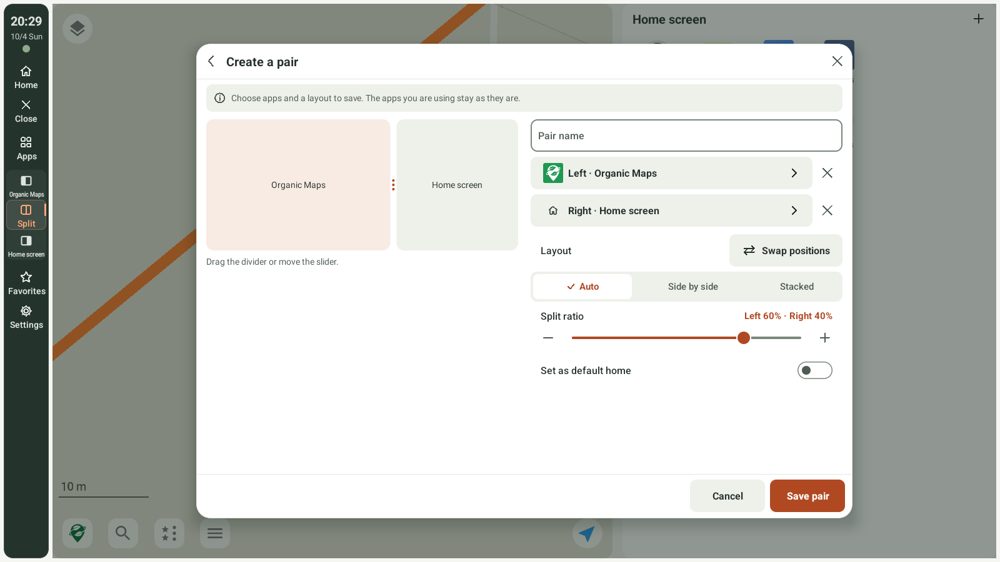

# M4 Launcher 1.3.0 app size, app list and pairs

[Overview](../README.en.md) · [한국어](preview.ko.md) · [Basic guide](guide.en.md)

**Stable 1.3.0** includes a size for each app, a scrolling app list and editable pairs. The preview channel currently offers 1.4.0-rc4; what this page describes is the same on both channels. Install over your existing app to retain settings. The Home button opens the [home screen](guide.en.md#3-home-screen); hold it for Settings.

## Update from the app

Open **Settings → Updates**, then **Check for updates → Download update → Install update**. Confirm installation in Android. You do not need to find and transfer each APK manually. Installation permission is separate from the built-in, root or Shizuku connection permission. **Receive preview versions** switches to the preview channel, where a version can be tried before it becomes stable; at present stable offers 1.3.0 and preview offers 1.4.0-rc4.

Each update check uses a fresh request URL to reduce stale CDN metadata immediately after publication. Only newer version codes are offered; changing channels does not downgrade the app. Cancelling installation preparation also suppresses an installer callback that has already been queued.

## Scale each app separately

*Actual Android 13 emulator capture. The apps shown are installed separately on the emulator and are not part of M4 Launcher.*

Hold an app in the app list and open **App size (DPI)**. The default size and the sizes of the apps in the two panes are also under **Settings → Display → App size**. The default and per-app sizes range over **120–640dpi**. A higher value makes text and controls larger, with less content visible at once.

A per-app size follows the app's package when the app moves to the other pane or a saved pair is launched. Switch on **Use default size** to remove it. **Apply** saves the size and the panes take it at once. Per-app sizes do not apply when opening an app separately or in **Protected video compatibility** mode, which uses the device display scale. Apps impose their own minimum widths and layout rules; reduce the value if content becomes cramped. This setting does not lower the pane's pixel resolution.

The home screen is drawn at the launcher's own size whatever the app size is. The content of widgets on the home screen follows the app size of that pane.

## Scrolling app list

*Actual Android 13 emulator capture. The list may include test apps installed on the emulator.*

Choose All, Favorites, Recent, Navigation, Music & video or Other apps on the left, then scroll the app grid vertically. Search and the two target panes stay above the grid. Where the list is narrow, the target panes move under the search field, and one goes above the other if needed, so that their names are not cut. Refreshing installed apps preserves your query and target pane. Initial scans show loading status, and failed scans offer a retry.

Tap an app to open it in the target pane; hold it for App options. On the home screen, the **All apps** button of the dock or a swipe up from the foot of the screen opens the same list inside that pane. With an icon pack chosen under **Settings → General → Icon pack**, the list shows the pack's icons.

## Build a pair

*Actual Android 13 emulator capture. The apps shown are installed separately on the emulator. This is not a vehicle photograph.*

1. Tap Settings, or hold Home, then choose **Apps & pairs → App pairs → Create a pair**. Holding **Split** on the control bar and choosing **App pairs** opens the same list.
2. Enter a pair name and choose apps. One pane may be empty; the same app cannot occupy both.
3. Under **Layout**, choose Auto, Side by side or Stacked, and use **Swap positions** to change the order. Drag the preview divider or move the slider to set a **Split ratio** between 30% and 70%.
4. Enable **Set as default home** if desired.
5. **Save pair** adds the pair without launching it. Tap the saved row to apply its apps and layout.

The pair list and the editor open inside Settings, in the place of the page; the categories stay on the left. App selection, preview and cancellation leave the running apps unchanged. Wide screens show the preview and the fields in two columns. Save pair and Cancel stay in a fixed footer; the on-screen keyboard leaves the name and the save button accessible. Leaving a modified draft through the control bar, a settings category or Close asks before discarding it. Activity recreation and language changes restore the draft and the app list.

Use a pair's **⋯** button, or hold the pair, for Launch, Edit pair, Set as default home / Remove as default home, or Delete pair. Up to eight pairs are supported. Duplicate names and capacity limits show an error instead of silently overwriting or deleting another pair. Pairs containing removed apps remain editable.

Setting a default home for the first time makes the **Home button** open it. Choose again between **Home screen** and **Default home** under **Settings → Home screen → Home button**. If the default home cannot run as saved because one of its apps is gone, Home returns to a split of the current apps. The quick **Save current apps and layout as default home** action remains available. Clearing the default home makes Home open the home screen again. Running a pair retains each app's own size.

## Recover the built-in connection after a restart

Open **Reconnect with saved pairing** in Built-in connection setup, then **Check connection again**. If wireless debugging is already on but connection fails, switch it off and on in Android settings and return.

If discovery still fails, enter the number after the colon in Android Wireless debugging's **IP address & Port**. **This is different from the port on the pairing-code screen.** The check uses saved pairing to connect only to this device, and saves the port only after success. Invalid ports, failed checks and cancellation do not erase pairing. Pair again if the launcher itself was removed from Android's paired-device list. It is listed there as M4 Launcher, or as DriveDeck if the pairing was made under that name.

## Backup and compatibility

Backups include named pairs, the default home's apps, direction, order and ratio, the Home button choice, per-app sizes, the chosen icon pack and the home screen: its apps, folders, places, background and settings. Older backups remain supported, including those made by DriveDeck; a backup from 1.2.1 or older leaves the home screen on the device as it is. Invalid formats and ranges reject the whole import before changing settings. Installed apps, connection permissions, Android language settings, the widgets on the home screen and the picture chosen as My photo are not included.

A physical-keyboard ordering issue was found in the 1.1.1 validation: when Android or another app forces input back to the default display immediately before rapid typing, the first forwarded letter may arrive out of order. That forced-focus test failed with both the built-in connection and Shizuku and was excluded from the pass count. It has not been confirmed fixed in 1.3.0. Tap the intended app's text field again before continuing.

Known limit: with a hardware keyboard attached, the on-screen keyboard hidden and Android's own (AOSP) keyboard in use, a pane sometimes takes no touch after a text field in it was tapped. It was seen on the test emulator, has been there since 1.2.0, and has not been checked on a real unit.

Stable publication does not establish exhaustive validation of vehicle controls, Bluetooth hardware, ignition power or manufacturer firmware. Not yet checked on the real 엠스틱4 and Galaxy Z Fold8. The 1.1.1 validation also reproduced an emulator LatinIME service ANR, an IME crash while attaching to a removed display, invisible keyboard-window touch interception and renderer delays during startup and connection recovery. The preceding 1.1.1-rc2 APK also reproduced a LatinIME ANR and roughly 6.1–6.4-second startup delays. Those failures remain recorded; later passing rechecks do not establish root-cause resolution. Orientation stays locked while running. See [validation scope](validation.md) for successful and failed coverage.
