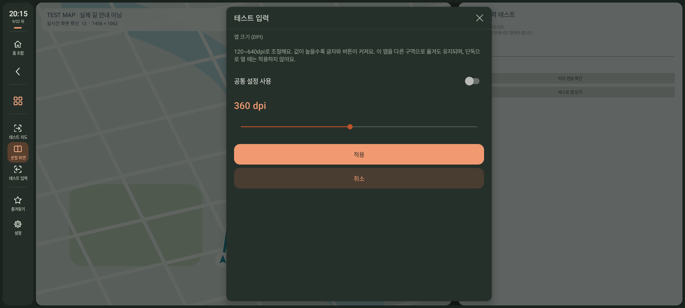
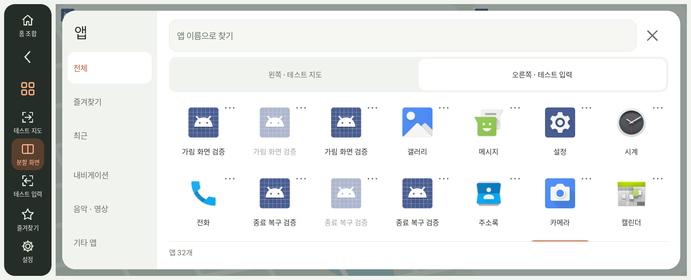
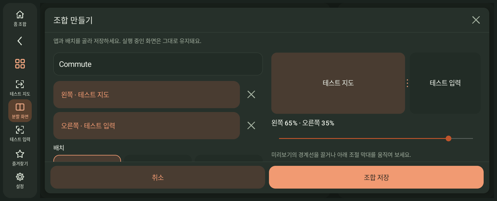

# DriveDeck 1.1.1 배율·서랍·조합 사용법

[한국어 소개](../README.md) · [English](preview.en.md) · [기본 사용법](guide.ko.md)

**정식 1.1.1**은 앱별 배율, 스크롤 앱 서랍, 직접 편집하는 홈 조합을 제공합니다. **홈 한 번 누르기 → 기본 홈, 길게 누르기 → 설정**입니다. 정식·시험 채널 모두 같은 1.1.1을 제공하며 기존 앱 위에 설치하면 설정을 유지합니다. 아래 이미지는 1.1.1-rc2 촬영본입니다.

## 앱에서 업데이트

**설정 → 업데이트 → 업데이트**에서 **새 버전 확인 → 다운로드 → 설치**를 누릅니다. Android 설치 확인은 직접 눌러야 합니다. APK를 매번 찾아서 옮길 필요는 없습니다. 설치 권한은 앱 연결에 쓰는 자체 연결·루트·Shizuku 권한과 별개입니다.

배포 직후 이전 버전이 보이는 CDN 캐시 영향을 줄이도록 버전 확인 주소를 매 요청마다 갱신합니다. 이미 설치한 버전보다 높은 버전만 안내하며, 채널 변경으로 자동 다운그레이드하지 않습니다. 설치 준비를 취소하면 대기 중인 설치창도 열지 않습니다.

## 앱마다 글씨와 버튼 크게

*1.1.1-rc2 APK의 Android 13 에뮬레이터 화면입니다. 표시된 테스트 앱은 배율·입력 검증에 사용하는 별도 앱입니다.*

앱 목록에서 **⋯ 또는 길게 누르기 → 앱 크기 (DPI)**를 엽니다. **설정 → 앱**에서도 선택한 앱의 크기를 조절할 수 있습니다. 공통 배율과 앱별 배율은 **120~640dpi** 범위입니다. 숫자를 높이면 글씨·버튼이 커지고 한 번에 보이는 내용은 줄어듭니다.

앱별 설정은 패키지에 저장됩니다. 앱을 바꾸거나 조합을 실행해도 그 앱의 배율을 다시 사용합니다. **공통 설정 사용**으로 개별 설정을 해제합니다. 단독 실행에는 개별 배율을 적용하지 않습니다. 앱마다 지원하는 최소 너비와 화면 구성이 다르므로 너무 크게 보이면 값을 낮춰 주세요. 픽셀 해상도를 낮추는 설정은 아닙니다.

## 스크롤 앱 서랍

*실제 에뮬레이터 화면입니다. 목록에는 동작 검증용 테스트 앱이 함께 표시됩니다.*

왼쪽에서 전체·즐겨찾기·최근·내비·미디어·기타를 선택하고, 오른쪽 격자를 위아래로 스크롤합니다. 검색과 대상 구역 선택은 고정됩니다. 앱 목록을 다시 읽어도 입력한 검색어와 선택한 대상이 유지됩니다. 처음 목록을 읽을 때는 진행 상태를 표시하고 실패하면 재시도할 수 있습니다.

## 홈 조합 직접 만들기

*1.1.1-rc2의 실제 Android 13 에뮬레이터 화면입니다. ‘테스트 지도’와 ‘테스트 입력’은 입력·배치 검증용 앱입니다. 실차 사진은 아닙니다.*

1. 홈을 길게 눌러 설정을 연 뒤 **앱 → 앱 조합 → 조합 만들기**를 선택합니다.
2. 이름과 두 구역의 앱을 고릅니다. 한 구역을 비워도 되지만 같은 앱을 양쪽에 넣을 수는 없습니다.
3. 자동·좌우·위아래 배치와 순서를 고릅니다. 미리보기 경계를 드래그하거나 슬라이더로 30~70% 비율을 맞춥니다.
4. 자주 돌아올 구성이라면 **기본 홈으로 지정**을 켭니다.
5. **저장**하면 목록에만 저장합니다. 목록의 조합을 누르면 실제 앱과 배치에 적용합니다.

편집 중 앱 선택·미리보기·취소는 실행 중인 두 앱을 바꾸지 않습니다. 낮고 넓은 화면에서는 편집 항목을 두 열로 표시합니다. 저장·취소 버튼은 아래에 고정됩니다. 화면 키보드로 이름을 입력할 때도 입력란과 저장 버튼을 키보드 위에 표시합니다. 수정한 내용을 두고 사이드바나 닫기를 누르면 버릴지 확인합니다. 화면 재생성·언어 변경 중 편집 내용과 앱 선택 화면도 복원합니다.

각 조합의 **⋯**에서 실행·편집·기본 홈 지정/해제·삭제를 선택합니다. 최대 8개이며, 같은 이름이나 한도 초과 저장은 안내를 표시합니다. 기존 조합을 조용히 덮어쓰거나 오래된 조합을 자동 삭제하지 않습니다. 앱 삭제로 실행할 수 없게 된 조합도 목록에서 편집할 수 있습니다.

**홈 한 번 누르기**는 기본 홈을 실행하고 **길게 누르기**는 설정을 엽니다. 기본 홈이 없으면 현재 선택한 앱의 분할 화면으로 돌아갑니다. **현재 구성을 기본 홈으로 저장**은 빠르게 지정하는 기능으로 남아 있습니다. 조합 실행은 각 앱의 개별 배율을 유지합니다.

## 재부팅 후 자체 연결 복구

자체 연결 설정의 **기존 페어링으로 재연결**에서 **연결 다시 확인**을 누릅니다. 무선 디버깅이 켜져 있는데도 연결이 안 되면 Android 설정에서 한 번 껐다 켠 뒤 돌아오세요.

자동 검색이 계속 실패하면 Android 무선 디버깅의 **IP 주소 및 포트**에서 콜론 뒤 숫자를 입력합니다. **페어링 코드 화면의 포트와 다릅니다.** 저장된 페어링으로 이 기기에만 연결하며, 연결 확인에 성공한 포트만 저장합니다. 잘못된 번호·연결 실패·취소로 기존 페어링을 지우지 않습니다. Android에서 DriveDeck 페어링 자체를 삭제한 경우에는 다시 페어링해야 합니다.

## 백업과 호환성

설정 백업에는 이름을 붙인 조합, 기본 홈의 앱·방향·순서·비율, 앱별 배율이 포함됩니다. 이전 백업도 복원할 수 있습니다. 잘못된 형식이나 범위를 발견하면 일부만 적용하지 않고 복원을 거부합니다. 앱 설치와 연결 권한, Android 언어 설정은 백업하지 않습니다.

물리 키보드에서는 Android나 다른 앱이 입력 대상을 기본 화면으로 강제 전환한 직후 빠르게 입력하면 첫 글자의 순서가 바뀌는 문제가 남아 있습니다. 이 강제 전환 검사는 자체 연결과 Shizuku 모두 실패했으며 통과 수에서 제외합니다. 입력할 앱의 입력란을 다시 눌러 사용해 주세요.

정식 배포가 실제 차량의 핸들 버튼·Bluetooth·시동 전원·제조사 펌웨어를 모두 검증했다는 뜻은 아닙니다. 앱 창이 준비되기 전에 보낸 내부 키로 입력이 막히던 경로를 수정했고, 반복 절전·설정 복귀·강제 종료 복구를 재검사했습니다. 검증 중 에뮬레이터의 LatinIME 서비스 ANR, 사라진 디스플레이에 입력창을 붙이려던 입력기 충돌, 보이지 않는 키보드 창의 터치 가림과 시작·연결 복구 중 렌더러 지연이 재현됐습니다. 이전 rc2 APK에서도 LatinIME ANR과 약 6.1~6.4초의 시작 지연이 기록됐습니다. 해당 실패를 보존했으며, 이후 재검사 통과를 근본 해결로 간주하지 않습니다. 실행 중 화면 방향은 고정됩니다. 자세한 성공·실패 범위는 [검증 기록](validation.md)을 확인하세요.
