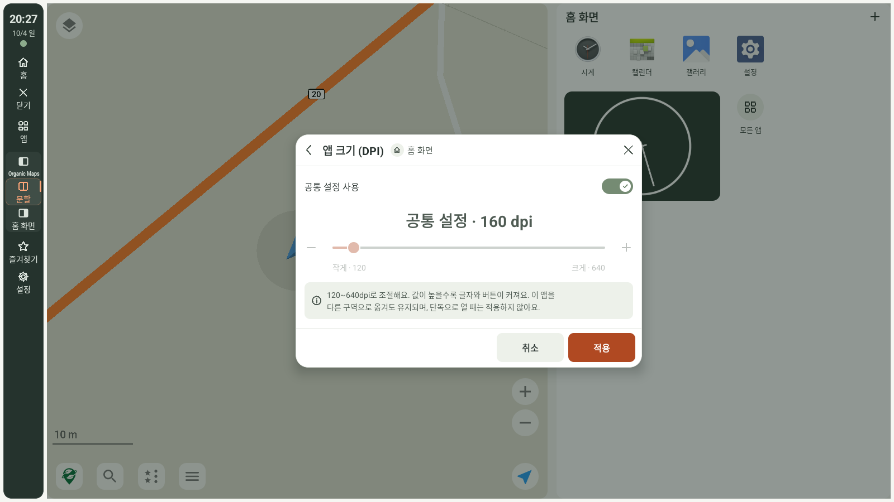
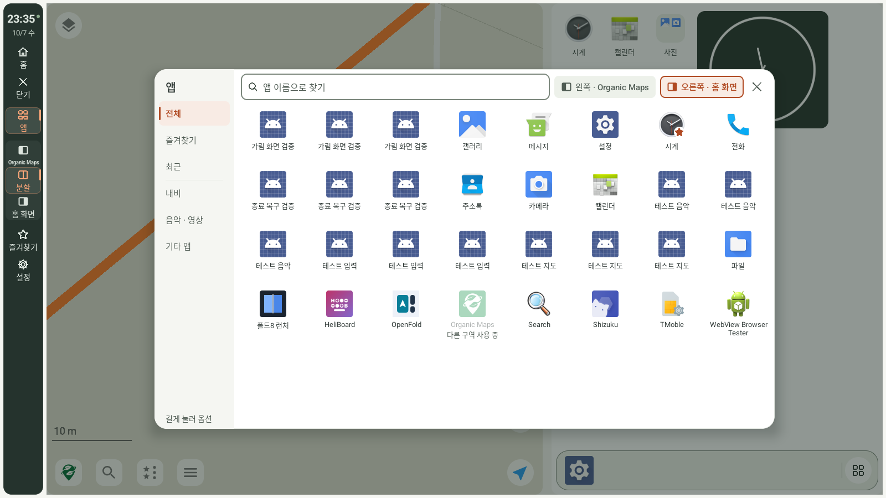
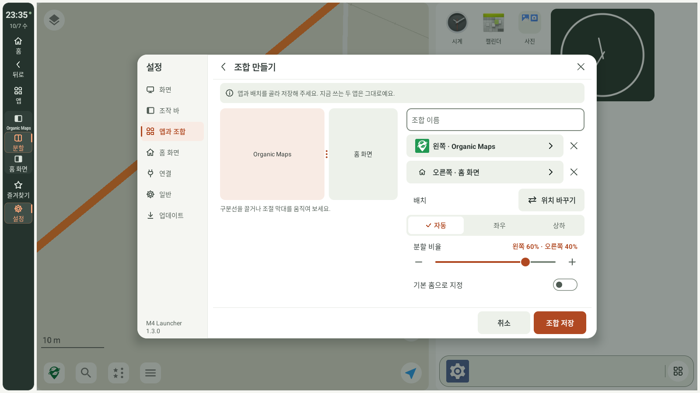

# M4 Launcher 1.3.0 앱 크기·앱 목록·조합 사용법

[한국어 소개](../README.md) · [English](preview.en.md) · [기본 사용법](guide.ko.md)

**정식 1.3.0**은 앱마다 다른 앱 크기, 스크롤 앱 목록, 직접 편집하는 조합을 제공합니다. 지금 시험 채널은 1.4.0-rc3을 제공합니다. 이 문서의 내용은 두 채널에서 같습니다. 시험 채널에 먼저 나왔던 새 이름과 새 아이콘, 새 홈 화면(자유 배치, 여러 페이지, 하단 바, 폴더, 배경, 쓸어 올리는 앱 목록)도 1.3.0부터 정식 채널에 들어 있습니다. 기존 앱 위에 설치하면 설정을 유지합니다. 홈 버튼은 [홈 화면](guide.ko.md#3-홈-화면)을 열고, 길게 누르면 설정을 엽니다.

## 앱에서 업데이트

**설정 → 업데이트**에서 **새 버전 확인 → 업데이트 다운로드 → 업데이트 설치**를 누릅니다. Android 설치 확인은 직접 눌러야 합니다. APK를 매번 찾아서 옮길 필요는 없습니다. 설치 권한은 앱 연결에 쓰는 자체 연결·루트·Shizuku 권한과 별개입니다. **시험 버전 받기**를 켜면 시험 채널을 확인합니다. 지금 정식 채널은 1.3.0, 시험 채널은 1.4.0-rc3입니다.

배포 직후 이전 버전이 보이는 CDN 캐시 영향을 줄이도록 버전 확인 주소를 매 요청마다 갱신합니다. 이미 설치한 버전보다 높은 버전만 안내하며, 채널 변경으로 자동 다운그레이드하지 않습니다. 설치 준비를 취소하면 대기 중인 설치창도 열지 않습니다.

## 앱마다 글씨와 버튼 크게

*실제 Android 13 에뮬레이터 화면입니다. 화면에 보이는 앱은 에뮬레이터에 따로 설치한 앱이며 M4 Launcher에 포함되지 않습니다.*

앱 목록에서 앱을 **길게 누르기 → 앱 크기 (DPI)**를 엽니다. **설정 → 화면 → 앱 크기**에서도 공통 앱 크기와 두 구역에 있는 앱의 크기를 조절할 수 있습니다. 설정에서 열면 앱 크기 화면이 설정 안에 열리고 왼쪽 분류는 그대로 남습니다. 공통 앱 크기와 앱별 크기는 **120~640dpi** 범위입니다. 숫자를 높이면 글씨·버튼이 커지고 한 번에 보이는 내용은 줄어듭니다.

앱별 설정은 패키지에 저장됩니다. 앱을 다른 구역으로 옮기거나 조합을 실행해도 그 앱의 크기를 다시 사용합니다. **공통 설정 사용**을 켜면 개별 설정을 해제합니다. **적용**을 누르면 저장하고 구역에 바로 반영합니다. 단독 실행과 **보호 영상 호환 모드**에는 개별 크기를 적용하지 않습니다. 앱마다 지원하는 최소 너비와 화면 구성이 다르므로 너무 크게 보이면 값을 낮춰 주세요. 픽셀 해상도를 낮추는 설정은 아닙니다.

홈 화면은 앱 크기와 관계없이 런처와 같은 크기로 그립니다. 홈 화면에 올린 위젯의 내용은 그 구역의 앱 크기를 따릅니다.

## 스크롤 앱 목록

*실제 Android 13 에뮬레이터 화면입니다. 목록에는 에뮬레이터에 설치한 시험 앱이 함께 보일 수 있습니다.*

왼쪽에서 전체·즐겨찾기·최근·내비·음악 · 영상·기타 앱을 선택하고, 오른쪽 격자를 위아래로 스크롤합니다. 검색과 대상 구역 선택은 위쪽에 고정됩니다. 자리가 좁으면 대상 구역 표시가 검색 칸 아래로 내려가고, 그래도 모자라면 두 줄로 놓입니다. 앱 목록을 다시 읽어도 입력한 검색어와 선택한 대상이 유지됩니다. 처음 목록을 읽을 때는 진행 상태를 표시하고 실패하면 다시 시도할 수 있습니다.

앱을 누르면 대상 구역에 열고, 길게 누르면 앱 옵션이 열립니다. 조작 바의 앱 이름 버튼을 길게 눌러도 그 구역에 열 앱 목록이 열립니다. 홈 화면의 **모든 앱**도 같은 목록을 그 구역 안에 엽니다. 홈 화면에서는 아래쪽에서 위로 쓸어 올리거나 하단 바 끝의 버튼을 눌러 엽니다.

## 조합 직접 만들기

*실제 Android 13 에뮬레이터 화면입니다. 화면에 보이는 앱은 에뮬레이터에 따로 설치한 앱입니다. 실차 사진은 아닙니다.*

1. 설정 버튼을 누르거나 홈을 길게 눌러 설정을 연 뒤 **앱과 조합 → 앱 조합 → 조합 만들기**를 선택합니다. 조작 바의 **분할** 버튼을 길게 눌러 **앱 조합**을 골라도 같은 목록이 열립니다.
2. 조합 이름과 두 구역의 앱을 고릅니다. 한 구역을 비워도 되지만 같은 앱을 양쪽에 넣을 수는 없습니다.
3. **배치**에서 자동·좌우·상하를 고르고 **위치 바꾸기**로 순서를 바꿉니다. 미리보기 구분선을 끌거나 조절 막대로 30~70% **분할 비율**을 맞춥니다.
4. 자주 돌아올 구성이라면 **기본 홈으로 지정**을 켭니다.
5. **조합 저장**을 누르면 목록에만 저장합니다. 목록의 조합을 누르면 실제 앱과 배치에 적용합니다.

조합 목록과 편집 화면은 설정 안에 열리고 왼쪽 분류는 그대로 남습니다. 편집 중 앱 선택·미리보기·취소는 실행 중인 두 앱을 바꾸지 않습니다. 넓은 화면에서는 미리보기와 편집 항목을 두 열로 표시합니다. 조합 저장·취소 버튼은 아래에 고정됩니다. 화면 키보드로 이름을 입력할 때도 입력란과 저장 버튼을 키보드 위에 표시합니다. 수정한 내용을 두고 조작 바나 닫기, 설정의 다른 분류를 누르면 버릴지 확인합니다. 화면 재생성·언어 변경 중 편집 내용과 앱 선택 화면도 복원합니다.

각 조합의 **⋯** 또는 길게 누르기에서 실행·조합 편집·기본 홈으로 지정/기본 홈 해제·조합 삭제를 선택합니다. 최대 8개이며, 같은 이름이나 한도 초과 저장은 안내를 표시합니다. 기존 조합을 조용히 덮어쓰거나 오래된 조합을 자동 삭제하지 않습니다. 앱 삭제로 실행할 수 없게 된 조합도 목록에서 편집할 수 있습니다.

기본 홈을 처음 지정하면 **홈 버튼**이 기본 홈을 엽니다. **설정 → 홈 화면 → 홈 버튼**에서 **홈 화면**과 **기본 홈** 중에서 다시 고를 수 있습니다. 기본 홈의 앱이 없어져 그대로 실행할 수 없으면 현재 앱의 분할 화면으로 돌아갑니다. **지금 앱과 배치를 기본 홈으로 저장**은 빠르게 지정하는 기능으로 남아 있습니다. 기본 홈을 지우면 홈 버튼은 다시 홈 화면을 엽니다. 조합 실행은 각 앱의 개별 앱 크기를 유지합니다.

## 재부팅 후 자체 연결 복구

자체 연결 설정의 **기존 페어링으로 재연결**에서 **연결 다시 확인**을 누릅니다. 무선 디버깅이 켜져 있는데도 연결이 안 되면 Android 설정에서 한 번 껐다 켠 뒤 돌아오세요.

자동 검색이 계속 실패하면 Android 무선 디버깅의 **IP 주소 및 포트**에서 콜론 뒤 숫자를 입력합니다. **페어링 코드 화면의 포트와 다릅니다.** 저장된 페어링으로 이 기기에만 연결하며, 연결 확인에 성공한 포트만 저장합니다. 잘못된 번호·연결 실패·취소로 기존 페어링을 지우지 않습니다. Android의 페어링 목록에서 M4 Launcher 페어링 자체를 삭제한 경우에는 다시 페어링해야 합니다. 이름이 바뀌기 전에 해 둔 페어링은 그 목록에 DriveDeck으로 나옵니다.

## 백업과 호환성

설정 백업에는 이름을 붙인 조합, 기본 홈의 앱·방향·순서·비율, 홈 버튼 선택, 앱별 앱 크기가 포함됩니다. 홈 화면의 앱, 폴더, 자리, 배경과 홈 화면 설정도 함께 들어갑니다. 이전 백업도 복원할 수 있으며, 홈 화면이 들어 있지 않은 예전 백업은 이 기기의 홈 화면을 그대로 둡니다. 잘못된 형식이나 범위를 발견하면 일부만 적용하지 않고 복원을 거부합니다. 앱 설치와 연결 권한, Android 언어 설정, 홈 화면의 위젯, 배경으로 고른 사진은 백업하지 않습니다. 설정 백업과 복원은 **설정 → 일반**에 있습니다.

물리 키보드에서는 Android나 다른 앱이 입력 대상을 기본 화면으로 강제 전환한 직후 빠르게 입력하면 첫 글자의 순서가 바뀌는 문제가 1.1.1 검증에서 확인됐습니다. 그 강제 전환 검사는 자체 연결과 Shizuku 모두 실패했으며 통과 수에서 제외했습니다. 그 뒤 버전에서 해결됐다고 확인하지 못했습니다. 입력할 앱의 입력란을 다시 눌러 사용해 주세요.

1.3.0의 알려진 한계: 물리 키보드를 연결하고 화면 키보드를 숨겨 둔 채 Android 기본(AOSP) 키보드를 쓰면, 입력란을 누른 뒤 그 구역이 터치를 받지 않는 때가 있습니다. 검사 에뮬레이터에서 본 것으로 1.2.0부터 있었고, 실제 기기에서는 확인하지 못했습니다.

정식 배포가 실제 차량의 핸들 버튼·Bluetooth·시동 전원·제조사 펌웨어를 모두 검증했다는 뜻은 아닙니다. 실제 엠스틱4와 갤럭시 Z 폴드8로는 아직 확인하지 못했습니다. 1.1.1 검증 중에는 에뮬레이터의 LatinIME 서비스 ANR, 사라진 디스플레이에 입력창을 붙이려던 입력기 충돌, 보이지 않는 키보드 창의 터치 가림과 시작·연결 복구 중 렌더러 지연이 재현됐습니다. 그 전의 1.1.1-rc2 APK에서도 LatinIME ANR과 약 6.1~6.4초의 시작 지연이 기록됐습니다. 해당 실패를 보존했으며, 이후 재검사 통과를 근본 해결로 간주하지 않습니다. 실행 중 화면 방향은 고정됩니다. 자세한 성공·실패 범위는 [검증 기록](validation.md)을 확인하세요.
