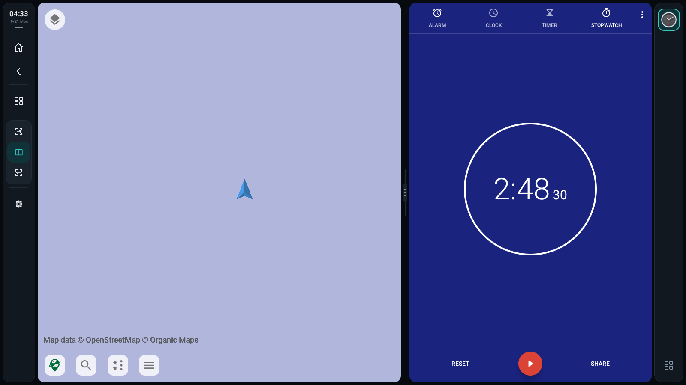
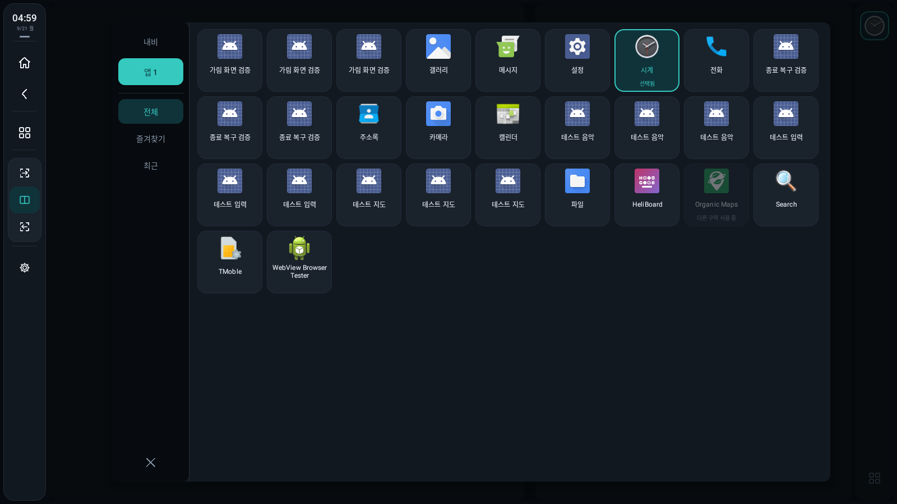
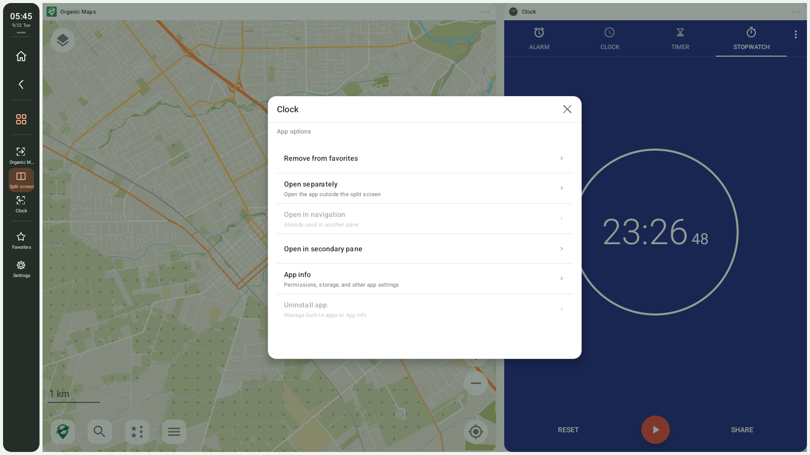
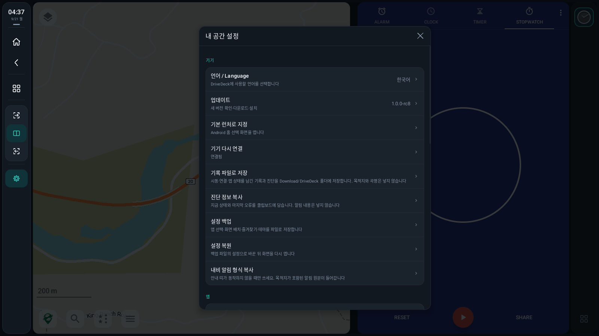
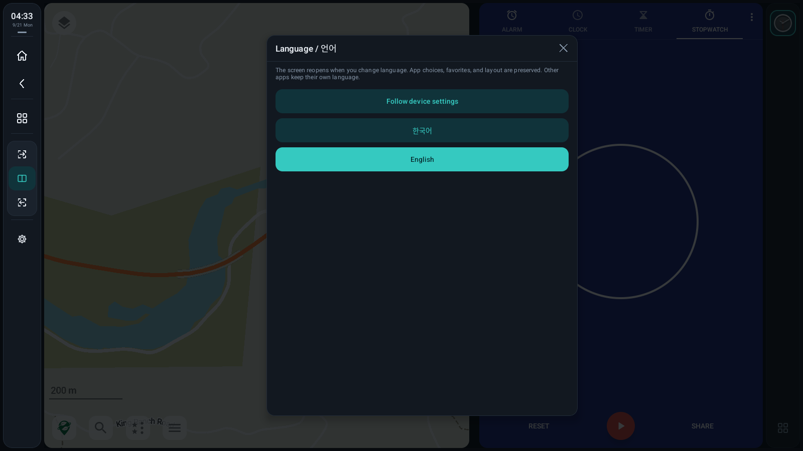
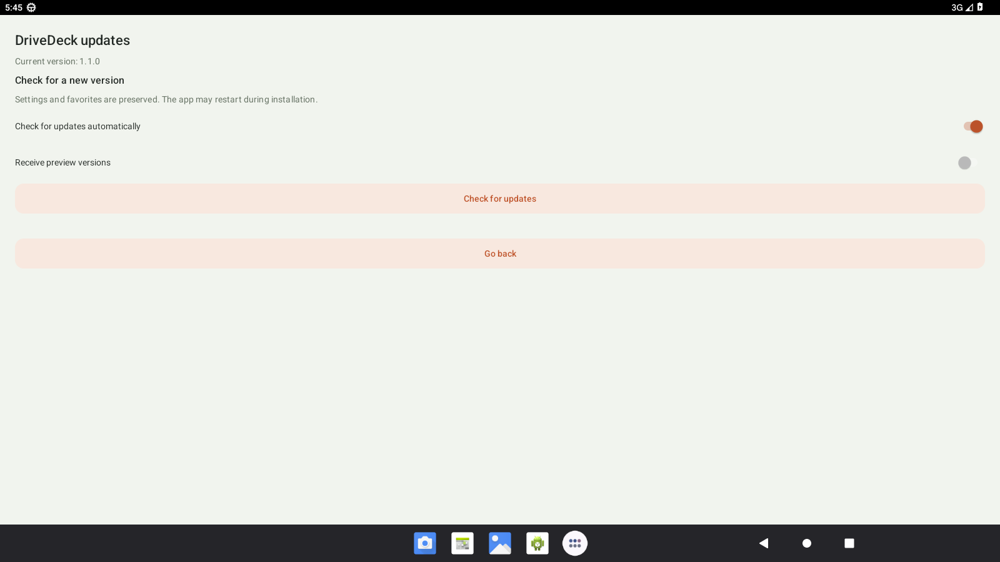
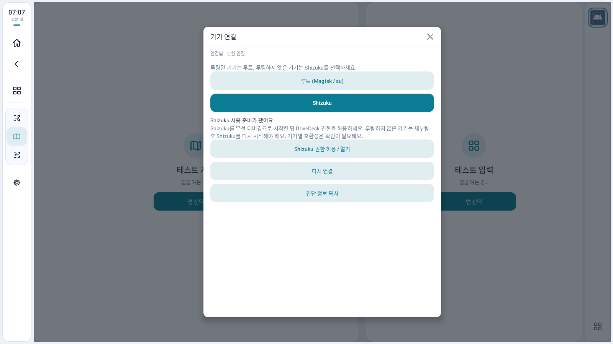

# 화면 모음 / Screenshot gallery

[한국어 설명](../README.md) · [English overview](../README.en.md)

1.0.0과 같은 기능 화면을 RC8에서 촬영한 실제 Android 13 에뮬레이터 이미지입니다. 업데이트 화면에는 촬영 당시 RC8 버전이 표시됩니다. 좌측 내비는 Organic Maps, 우측 앱은 Android 시계입니다. 별도 앱은 DriveDeck에 포함되지 않으며 자체 언어 설정을 따릅니다. 차량·주행 시험 사진이 아닙니다.

Actual Android 13 emulator captures taken on RC8, showing the same feature screens as 1.0.0. The update screen shows the RC8 version installed when captured. The navigation pane uses Organic Maps and App 1 uses Android Clock. These separate apps are not bundled and keep their own language settings. These are not vehicle or driving-test photographs.

앱 목록의 ‘테스트’·‘검증’ 이름은 에뮬레이터에 설치한 시험용 앱입니다. 별도 앱의 이름은 그대로 표시합니다. 영어 두 앱 사진은 지도 화면이 아직 그려지는 중이며, 언어별 사진의 외부 앱 표시 상태는 다를 수 있습니다.

Entries labeled ‘테스트’ or ‘검증’ are fixture apps installed on the emulator. App names are displayed as supplied by those apps. The map is still drawing in the English two-app capture; separate apps can show different states between captures.

## 두 앱 / Two apps

| 한국어 | English |
|---|---|
|  |  |

## 앱 선택 / App chooser

| 한국어 | English |
|---|---|
|  |  |

## 길게 누르기 / Hold for options

| 한국어 | English |
|---|---|
|  |  |

## 설정 / Settings

| 한국어 | English |
|---|---|
|  |  |

## 언어 / Language

| 한국어 | English |
|---|---|
|  |  |

## 업데이트 / Updates

| 한국어 | English |
|---|---|
|  |  |

## Shizuku 연결 / Shizuku connection (1.0.1-rc1)

아래 두 화면은 1.0.1-rc1 시험 버전에서 직접 캡처합니다. 위의 기존 12개 이미지는 RC8 기록입니다.

These two screenshots were captured from the 1.0.1-rc1 release APK at 1600?900. They show connection settings; the pane apps behind the dialog are still opening. The twelve images above remain RC8 captures.

| 한국어 | English |
|---|---|
|  |  |
