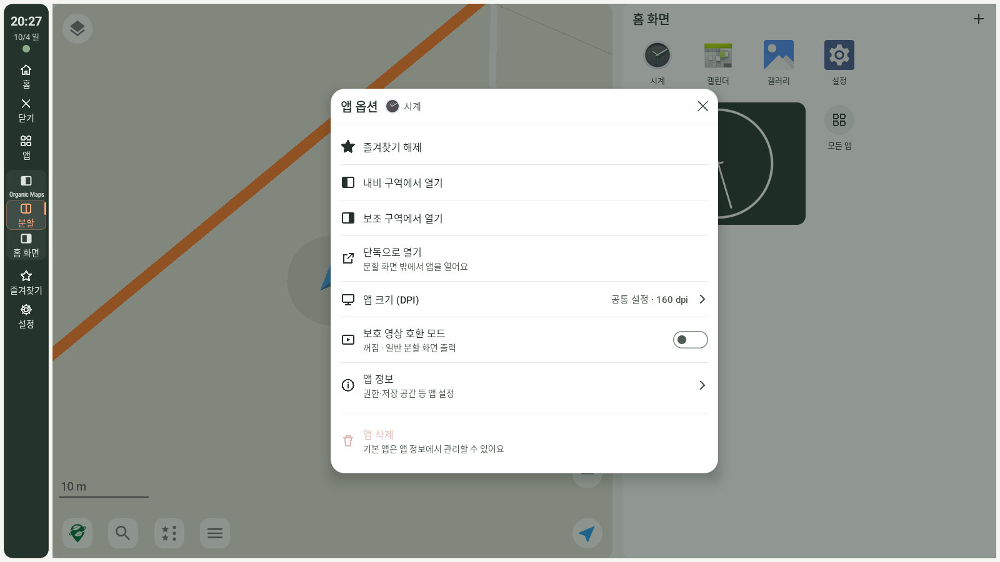
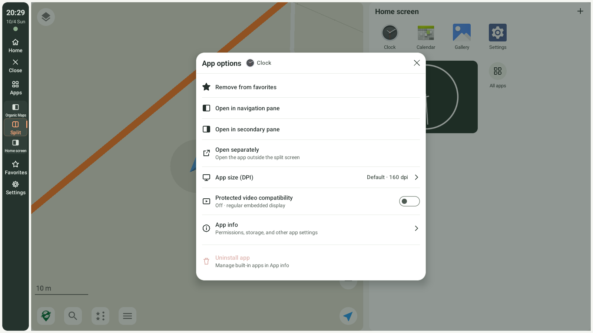
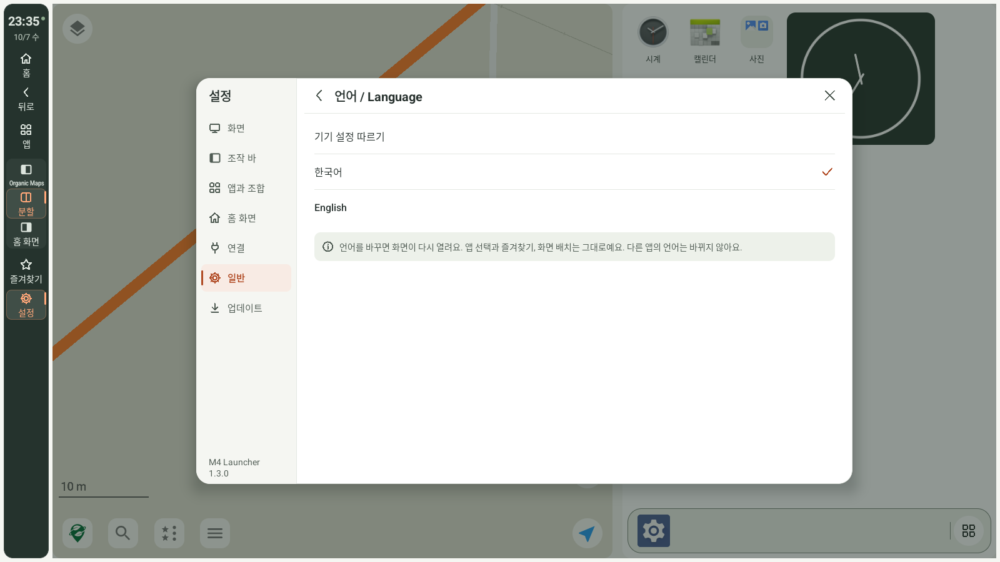
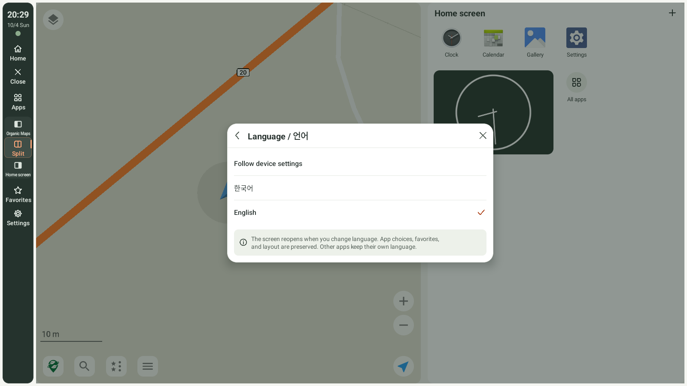
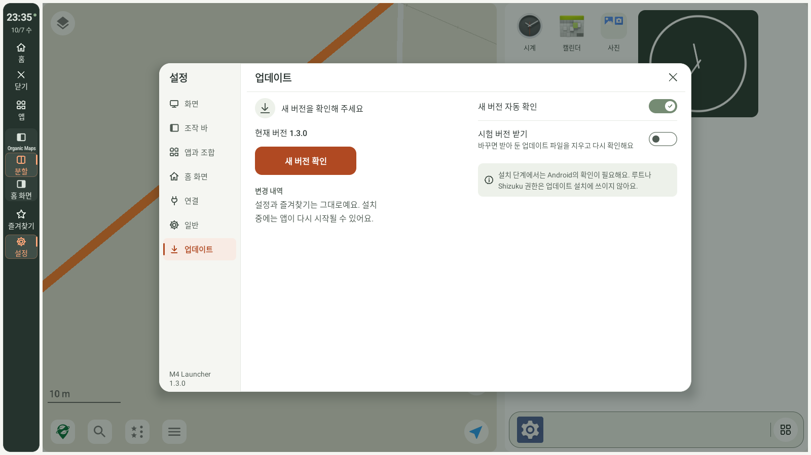
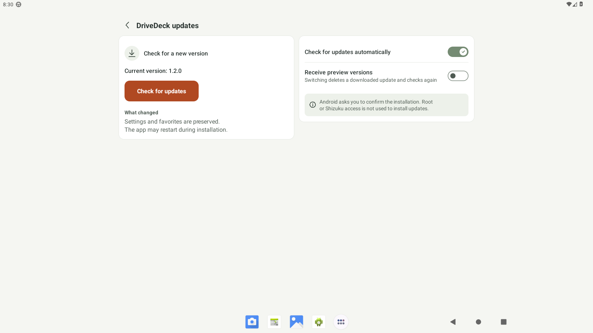

# 화면 모음 / Screenshot gallery

[한국어 설명](../README.md) · [English overview](../README.en.md)

실제 Android 13 에뮬레이터에서 촬영한 M4 Launcher 화면입니다. 지도·시계 같은 다른 앱과 홈 화면의 위젯은 따로 설치한 앱이 제공하며 자체 언어 설정을 따릅니다. 앱 목록에는 에뮬레이터에 설치한 시험 앱이 함께 보일 수 있습니다. 차량·주행 시험 사진이 아닙니다.

Actual Android 13 emulator captures of M4 Launcher. Other apps such as the map and the clock, and the widgets on the home screen, come from separately installed apps and keep their own language settings. The app list may include test apps installed on the emulator. These are not in-vehicle or driving-test photographs.

## 두 앱 / Two apps

지도 앱과 다른 앱을 나란히 띄운 화면입니다. / A map app and another app side by side.

| 한국어 | English |
|---|---|
|  |  |

## 홈 화면 / Home screen

지도 옆 구역에 앱 아이콘과 위젯을 올린 홈 화면입니다. / The home screen with app icons and widgets in the pane beside the map.

| 한국어 | English |
|---|---|
|  |  |

## 앱 목록 / App list

| 한국어 | English |
|---|---|
|  |  |

## 길게 누르기 / Hold for options

| 한국어 | English |
|---|---|
|  |  |

## 설정 / Settings

| 한국어 | English |
|---|---|
|  |  |

## 언어 / Language

| 한국어 | English |
|---|---|
|  |  |

## 업데이트 / Updates

| 한국어 | English |
|---|---|
|  |  |

## Shizuku 연결 / Shizuku connection

연결 방식에서 Shizuku를 고른 화면입니다. / The connection panel with Shizuku selected.

| 한국어 | English |
|---|---|
|  |  |

## 자체 연결 / Built-in connection

자체 연결 설정 화면입니다. / The built-in connection setup screen.

| 한국어 | English |
|---|---|
|  |  |

앱 크기·앱 목록·조합 편집 화면은 [사용법](preview.ko.md)에 있습니다. / The app size, app list and pair editor captures are in the [guide](preview.en.md).
